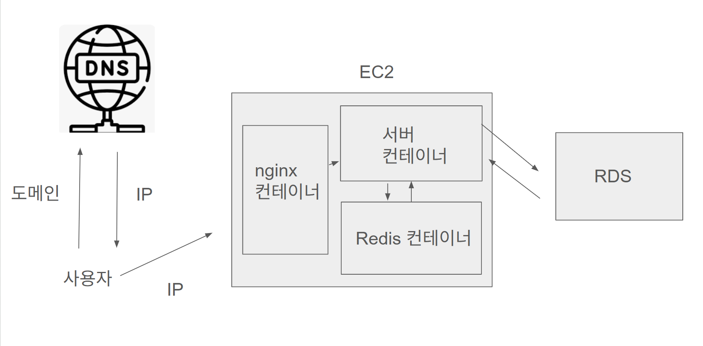
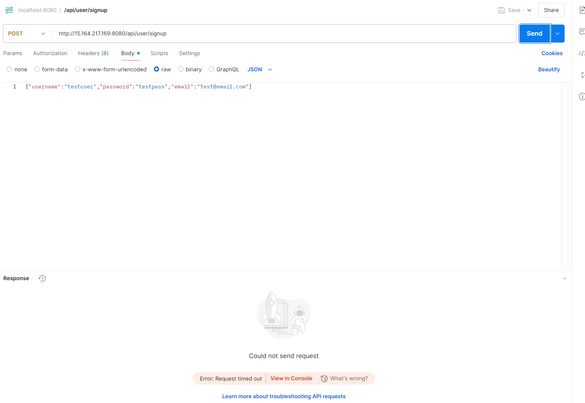
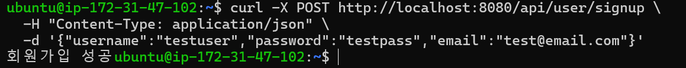
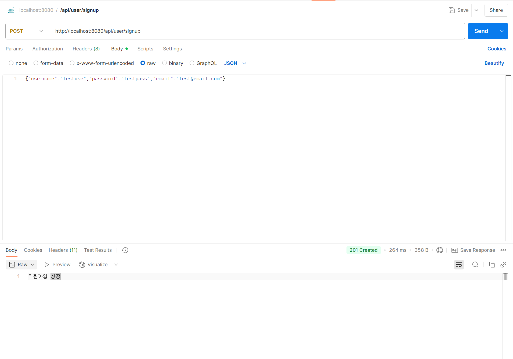

# spring-knowledgeIn-21st

ceos back-end 21st naver knowledge-in clone coding project

헷갈렸던 개념 정리

Q. 참조하는 쪽이 관계의 주인인가??
A. X 관계의 주인은 FK를 가진 쪽으로 결정이 됨. 참조하는 쪽이라고 항상 FK를 가지는 것이 아니기에 항상 참조하는 쪽이 관계의 주인인 것은 아님.

Q. 참조하는 쪽에 FK가 생기나??
A. X 관계의 종류(1:1, 1:N, N:1, N:N)에 따라 달라짐.

테이블 관계 정리

OneToOne : mappedBy가 없는 쪽에 FK(mapedBy가 없다 => 관계의 주인이다 => FK를 가진다.) //OneToOne은 아직 헷갈리네요...
ManyToOne : 참조하는 쪽(Many)에 FK가 생김
OneToMany : 참조받는 쪽(Many)에 FK가 생김
ManyToMany : 중간 테이블 만들어서 ManyToOne 또는 OneToMany를 만듦

=>ManyToOne, OneToMany 둘 다 Many 쪽에서 FK가 생김 => 이렇게 해야 데이터베이스가 더 깔끔해질 거 같긴 함(아닌가...?)

ex.
#Post - Member

Post(참조하는 쪽) -> Member(참조받는 쪽) 단방향 @Many(Post)ToOne(Member) : 포스트가 멤버를 참조함. => Post를 조회하면 어떤 멤버가 쓴 지 알 수 있음. 하지만 멤버를 조회한다고 해서 그 멤버가 쓴 모든 Post를 조회할 순 없음.

@Many(Post)ToOne(Member) 이기에 Many인 Post에 FK가 생기고 Post가 관계의 주인이 됨.

Post(참조하는 쪽) - Comment(참조받는 쪽) 단방향 @One(Post)ToMany(Comment) : 포스트가 코멘트를 참조함. => Post를
조회하면 거기에 달린 댓글을 확인할 수 있음. 하지만 댓글을 조회한다고 해서 어떤 게시물에 달린 것인지 알 수 없음.

@One(Post)ToMany(Comment) 이기에 Many인 Comment에 FK가 생기고 Comment가 관계의 주인이 됨.

단위테스트

---

개발순서

Repository => Dto => Service => Controller

: 이 순서대로 해야 can't solve 빨간줄 안 만나면서 개발을 할 수 있다.

DTO란? Data Transfer Object
프론트와 데이터를 주고 받을 때 엔티티에 있는 모든 데이터를 주고 받으면 효율적이지 않으니 프론트와 교환할 정보만 쏙 빼서 저장하는 오브젝트트

Lombok 어노테이션 정리
@Getter: get 메서드를 자동으로 만듬 ex. dto.getTitle()

@NoArgsConstructor: 기본 생성자(빈 생성자) 특히 Entity를 JPA에 등록할 때 꼭 필요함
@AllArgsConstructor: 명시된 모든 필드의 값을 생성자에 넣고 생성
@RequiredArgsConstructor: final이 붙은 애의 생성자 만들어줌

정적 팩토리 메서드란?

static으로 객체를 생성하는 메서드
그냥 생성자를 써도 되지만 나중에 복잡해지면 가독성이 좋아져서 쓰는 거 같음(이석원 피셜)

Global Exception : 모든 API마다 예외처리를 하면 중복도 많고 복잡해짐 => 글로벌하게 다루자

##Global Exception 처리 후 Swagger 에러가 발생하였음음

전역 예외처리 할 때 사용한 @RestControllerAdvice를 지우니 해결됨.
Swagger와 충돌이 일어난 것 같음

---

소개
JWT를 이용한 회원가입 로그인 구현

기능

- 회원가입(비밀번호 암포화, 권한 부여)
- 로그인(헤더를 통해 AccessToken 전달)
- 게시글 작성(토큰을 통해 유저 정보 확인 후 작성 가능)

유저 구현 방법

1. 세션 + 쿠키
2. Access Token(JWT)
3. Access Token + Refresh Token
4. OAuth 2.0

쿠키 vs 세션

- 세션과 쿠키가 필요한 이유:
  웹에서 사용자의 상태 정보를 유지하고 저장하는 기술
  HTTP는 기본적으로 stateless이기에 API를 통한 정보 전달이 끝나면 그 정보를 저장하지 않음.
  하지만 로그인 유지처럼 사용자 정보를 계속해서 저장해야하는 상황이 생김. => 이때 세션 또는 쿠키를 사용해서 구현함.

쿠키
브라우저에 저장되는 데이터
세션에 비해 보안에 취약, 클라이언트가 수정 가능 =>암호화 필수, 민감한 정보는 담지 않음

세션
서버에 저장

ex

1. 클라이언트가 서버에 로그인 요청
2. 서버는 로그인 요청 확인 후 올바른 유저이면 session id를 생성하고 저장
3. 서버가 클라이언트에 응답을 보낼 때 세션 ID도 같이 보냄.
4. 클라이언트가 이후 서버에 요청할 때 세션 ID를 같이 보내며 요청
5. 서버는 세션ID 값을 바탕으로 요청 처리

세션은 서버 기반이기에 쿠키보다 보안적으로 안전, 하지만 서버이기에 쿠키에 비해 느릴 수 있음.

=> 쿠키와 세션을 적절하게 사용하면 효율적으로 작업할 수 있음

OAuth (Open Authoization):
인터넷 사용자들이 비밀번호를 제공하지 않고 다른 웹사이트 상의 자신들의 정보로 웹사이트나 애플리케이션의 접근 권한을 부여할 수 있는 공통적인 수단

왜 생겼을까?

흐름(구글)

1. 프론트에서 로그인 요청 -> 구글 로그인 화면으로 리디렉션
2. 사용자 구글 로그인 성공 -> Google이 Authorization code 전달
3. 서버는 이 코드를 이용해 access token 요청
4. access token을 이용해 사용자 정보를 받아옴

관련 용어

1. Resource Owner: 사용자 본인
2. Client: 사용자 정보를 얻고자하는 애플리케이션
3. Authorization Server: 인증 및 권한 부여를 담당하는 제3자 서버
4. Resource Server: 보호된 자원을 호스팅하고 제공하는 서버

ex.

1. 사용자(Resource Owner)가 우리 앱(Client)에서 Google 로그인 버튼 클릭
2. Google(Authorization Server) 로그인 화면으로 이동해 인증
3. 인증 완료 → access token 발급
4. 우리 앱(Client)이 token을 들고 Google API(Resource Server)에서 사용자 정보 요청
5. 응답으로 사용자 이메일, 이름 등 제공됨

Access Token + Refresh Token 전달 및 보관 방식
=> AccessToken Authorization 헤더 + RefreshToken Cookie

프론트는 AccessToken을 메모리 or localStorage에 저장

---

<h1>🐳 Docker 학습 정리</h1>

<h2>1. Docker 관련 용어</h2>

<h3>- 컨테이너</h3>
<ul>
  <li>실행 중인 애플리케이션과 그 환경을 하나로 묶은 <strong>격리된 실행 단위</strong></li>
  <li>가볍고, 빠르게 배포 및 테스트 가능</li>
</ul>

<h3>- 컨테이너 이미지</h3>
<ul>
  <li>컨테이너 실행을 위한 <strong>설정 파일, 애플리케이션, 의존성</strong>이 포함된 정적 패키지</li>
  <li><code>Dockerfile</code>을 기반으로 생성됨</li>
</ul>

<h2>2. Docker 실행 순서</h2>
<ol>
  <li>Dockerfile 작성</li>
  <li><code>docker build</code> → 이미지 생성</li>
  <li><code>docker run</code> → 컨테이너 실행</li>
</ol>

<h2>3. 도커에서 로컬 MySQL 사용법</h2>

컨테이너 내부에서 로컬 MySQL을 사용하려면 <code>host.docker.internal</code> 주소를 사용해야 함 

<pre>
<code>
spring:
  datasource:
    url: jdbc:mysql://host.docker.internal:3306/your_db
</code>
</pre>

<h2>4. OpenJDK vs Eclipse Temurin</h2>

Docker Hub는 수년간 <code>openjdk</code> 이미지를 유지해왔지만, 2022년 7월부로 해당 이미지의 <strong>deprecated(더 이상 업데이트되지 않음)</strong>을 공식 발표했습니다.

기존 <code>openjdk</code> 이미지는 Eclipse Adoptium이나 기타 공급처의 OpenJDK Java SE 바이너리를 기반으로 구성되어 있었으나, 더 이상 <strong>기능/보안 업데이트가 제공되지 않기 때문에</strong> 사용에 주의가 필요합니다.

<h3>권장 사항</h3>
<ul>
  <li>Docker Hub는 <strong>Adoptium 프로젝트</strong> 또는 <strong>공식 Java 공급업체</strong>에서 제공하는 이미지를 사용할 것을 권장하고 있습니다.</li>
  <li>특히, <strong>Eclipse Temurin</strong> 이미지가 적절한 대체 이미지로 소개되었습니다.</li>
  <li>많은 기업(예: Red Hat 애플리케이션 등)이 <code>eclipse-temurin</code> 이미지로의 전환을 마친 상태입니다.</li>
</ul>

<h3>전환 예시</h3>

기존에 사용하던 Dockerfile의 base image를 다음과 같이 변경하면 됩니다:

<pre><code># 기존
FROM openjdk:17

# 변경
FROM eclipse-temurin:17
</code></pre>

<h3>에러 경험</h3>

처음엔 <code>openjdk</code> 이미지를 사용했는데, Docker 환경에서 Spring Boot 프로젝트를 실행할 때 <strong>exec /opt/java/openjdk/bin/java: exec format error</strong>가 지속적으로 발생했습니다.

<code>eclipse-temurin</code>로 전환한 이후에는 모든 문제가 해결되어 <strong>정상적으로 빌드 및 실행</strong>이 가능했습니다.

---

<h1>🌐 HTTPS 배포 환경 개념 정리</h1> 
<h2>1. DNS(Domain Name System)</h2> 
<ul> 
    <li>사람이 읽을 수 있는 <strong>도메인 주소</strong>를 실제 컴퓨터가 통신에 사용하는 <strong>IP 주소</strong>로 변환하는 시스템</li> 
    <li>예: <code>www.google.com</code> → <code>123.456.789.10</code></li> 
</ul> 

 
<h2>2. Load Balancer(로드 밸런서)</h2> 
<ul>
  <li>서버에 들어오는 <strong>트래픽을 여러 대의 서버에 적절하게 분산</strong>시켜주는 역할</li> 
  <li>장점: 트래픽 부하 분산, 장애 대응, 성능 향상</li> 
</ul> 
 
<h2>3. Nginx: 리버스 프록시 역할</h2> 
<ul>
  <li>외부 요청을 받아 내부 서버(또는 컨테이너)로 <strong>중개</strong>해주는 프록시 서버</li> 
  <li><strong>Docker 컨테이너와 통신</strong>하기 위한 게이트웨이 역할</li> 
  <li>주로 다음 포트를 사용:</li> 
<ul> 
  <li><code>80</code>: HTTP</li> 
  <li><code>443</code>: HTTPS</li> 
</ul> 
</ul> 
 <h2>4. HTTPS와 인증서</h2> <h3>① HTTPS란?</h3> <ul> <li><strong>HTTP에 보안(SSL/TLS)을 추가한 프로토콜</strong></li> <li>클라이언트와 서버 간 통신을 <strong>암호화</strong>하여 보안을 강화</li> </ul> <h3>② 인증서 역할</h3> 
<ul> 
  <li><strong>통신 암호화</strong>: HTTPS를 사용하기 위해 필수</li> 
  <li><strong>서버 신원 확인</strong>: 신뢰할 수 있는 서버임을 브라우저가 확인</li> 
  <li>브라우저 주소창에 🔒 자물쇠로 표시됨</li> 
</ul> 
<h3>③ 인증서 발급 조건</h3> 
<ul> 
  <li>자체 IP만으로는 인증서 발급 불가</li> 
  <li><strong>공인 도메인</strong>이 필요함 (ex. heattech-yonsei.shop)</li>
</ul> 
<h3>④ 인증서 적용 예시 (Nginx)</h3> 
<pre><code> server { listen 443 ssl; server_name your-domain.com;
ssl_certificate /etc/letsencrypt/live/your-domain.com/fullchain.pem;
ssl_certificate_key /etc/letsencrypt/live/your-domain.com/privkey.pem;

location / {
proxy_pass http://localhost:8080;
}
}
</code></pre>

<h3>⑤ 인증서 발급 방법</h3> 
<ul> 
  <li><strong>Let's Encrypt</strong> 같은 무료 인증 기관을 통해 발급 가능</li> 
  <li>도메인을 구매한 후, certbot 등의 툴로 쉽게 발급 가능</li> 
</ul> 
 
<h2>5. 기타: AWS의 인증서 사용</h2> 
<ul> 
  <li>AWS에서는 <strong>Application Load Balancer(ALB)</strong>에도 인증서를 적용 가능</li>
  <li>AWS Certificate Manager(ACM)를 통해 무료로 발급 가능</li>
</ul>

 왜 연결 자체가 안될까... ip도 맞고 보안그룹도 tcp8080 모든 IP 열었는데...

