### 네이버 지식인

**구현 기능**
1. 게시글 조회
2. 게시글에 사진과 함께 글, 해시태그 작성하기 
3. 게시글에 댓글 및 대댓글 기능
4. 게시글 댓글에 좋아요, 싫어요 기능
5. 게시글, 댓글, 좋아요 삭제 기능


#### 네이버 지식인 구조
1. 질문 (Post)


2. 답변 (Answer)


4. 좋아요/싫어요 (Like_dislike) + 댓글 (Comment)


## Mission 1️⃣ 데이터 모델링 
(1) **ERD****1. User**
- 한 명의 user은 여러개의 **Post, Aswer, like_dislike, comment**를 작성 가능 (User와 1:N 관계)

**2. Post**
- 하나의 Post에는 여러개의 **Comment, Answer, like_dislike, image** 작성 가능 (Post와 1:N 관계)
- Post와 **Hashtag**는 N:M 관계 -> 중간에 PostHash table 설정

**3. Answer**
- 하나의 Answer에는 여러개의 **comment, Image, like_dislike** 작성 가능 (Answer과 1:N 관계)

### (2) Entity 설계 

**1. LikeDislike**
```
@Enumerated(EnumType.STRING)
   private LikeStatus likestatus;

@Enumerated(EnumType.STRING)
    private TargetStatus targetstatus;
```
- 이 부분에서, LikeStatus는 Enum으로 관리하여 Like, Dislike 설정
- 좋아요/싫어요는 Post와 Answer에 달 수 있으므로 TargetStatus에서 Post, Answer로 관리

**2. Comment**
```
  @Enumerated(EnumType.STRING)
    private TargetStatus targetStatus;
```
- Comment 또한 Post와 Answer에 각각 작성 가능하므로 TargetStatus를 이용하여 하나의 테이블에서 관리

🌟 Comment는 갯수가 많지 않을 것 같고 코드 중복을 피하려고 이 방식을 사용했는데 Post_Comment와 Answer_Comment로 나누는게 나을까요? 의견 부탁드립니다 🌟


## Mission 2️⃣ Repository 단위 테스트 (Post Entity 사용)

**1. User 생성**
```
@BeforeEach
    public void setUp() {
        // 테스트에 사용할 사용자 데이터 생성
        user = User.builder()
                .nickname("dohyun")
                .email("dohyun@naver.com")
                .password("1234")
                .build();

        userRepository.save(user);
    }
```


**2. 작성자를 기준으로 FindPost**
- 첫번째 Post 생성 
```
@Test
    public void testFindByWriter() {
        // given

        //첫번째 질문글 (사진 X)
        Post post1 = Post.builder()
                .title("Post 1")
                .content("hello")
                .writer(user)
                .build();
        postRepository.save(post1);

```


- 두번째 Post 생성 
```
 Image image = Image.builder()
                .imageUrl("image.jpg") // 이미지 URL 설정
                .post(null)  // 아직 Post와 연결되지 않음
                .build();

        //2번째 질문글 (사진 1장)
        Post post2 = Post.builder()
                .title("Post 2")
                .content("one picture")
                .images(Collections.singletonList(image))
                .writer(user)
                .build();
        image.setPost(post2);
        postRepository.save(post2);
```


- 세번째 Post 생성
```
 //3번쨰 질문글 (사진 2장)
        Post post3 = Post.builder()
                .title("Post 3")
                .content("two pictures")
                .images(Arrays.asList())
                .writer(user)
                .build();
        postRepository.save(post3);

        Image image1 = Image.builder()
                .imageUrl("image_url_1")
                .post(post3)
                .build();

        Image image2 = Image.builder()
                .imageUrl("image_url_2")
                .post(post3)
                .build();

        imageRepository.save(image1);
        imageRepository.save(image2);

```


- Post DB


- Image DB
 

- 나머지 when/then
```
// when
        List<Post> posts = postRepository.findByWriter(user);
// then
        assertThat(posts).hasSize(3);
        assertThat(posts).extracting(Post::getTitle).containsExactly("Post 1", "Post 2","Post 3");
```


## Mission 3️⃣ JPA 관련 문제
### (1) 어떻게 data jpa는 interface만으로도 함수가 구현이 되는가?
```
public interface PostRepository extends JpaRepository<Post, Long> {
    List<Post> findByWriter(User writer);
}

```
- Spring이 애플리케이션을 실행하면서 PostRepository의 프록시 객체를 생성

- 인터페이스만 정의하면 Spring이 동적으로 구현체를 만들어 주입
이 때, SimpleJpaRepository 클래스가 작동하며 메서드 이름을 분석해 쿼리 자동 생성

> findByWriter(User writer)
→ "SELECT p FROM Post p WHERE p.writer = ?"

- Spring이 내부적으로 EntityManager를 사용하여 쿼리를 실행하고 결과 반환


### (2)  왜 계속 생성되는 entity manager를 생성자 주입을 이용하는가?
- **EntityManager은 싱글톤 객체가 아니다 !!**
- 트랜잭션이 시작될 때 새로운 EntityManager 객체가 동적으로 생성되며, 트랜잭션이 끝날 때 EntityManager는 폐기됨.

> ❔ **그럼 왜 생성자 주입?**
- EntityManager는 **프록시 객체**로 주입되며, 실제 트랜잭션 범위에서만 EntityManager가 생성되고 관리된다.
- 프록시 객체는 애플리케이션에서 하나의 인스턴스로 관리되며(싱글톤), 필요한 시점에 실제 EntityManager를 동적으로 생성한다.


### (3)  Fetch Join과 Distinct
- **Fetch Join** 이란?
  
 : JPQL에서 성능 최적화를 위해 제공하는 기능
 
 : 연관된 엔티티나 컬렉션을 SQL 한 번에 함께 조회하는 기능
 
 - **Fetch Join** 사용
 ```
"select t From Team t join fetch t.members where t.name = "팀A";
```

 : Name이 "팀A"인 Team을 조회하면서 해당 팀에 속한 members도  함께 즉시 로딩하여 가져오는 쿼리 (즉시 로딩)
  - 만약 "팀 A"에 **Member가 2명** 있다면?
    : **팀 A가 2번 중복** 됨
   
    
 - 이 때 !! **Distinct**를 사용하면
```
"select distinct t From Team t join fetch t.members where t.name = "팀A";
 ```
 : 중복되었던 "Team A"가 **한번** 만 나오게 된다.
 

 (참고 https://9hyuk9.tistory.com/77)

---
### WEEK 3. ERD 수정
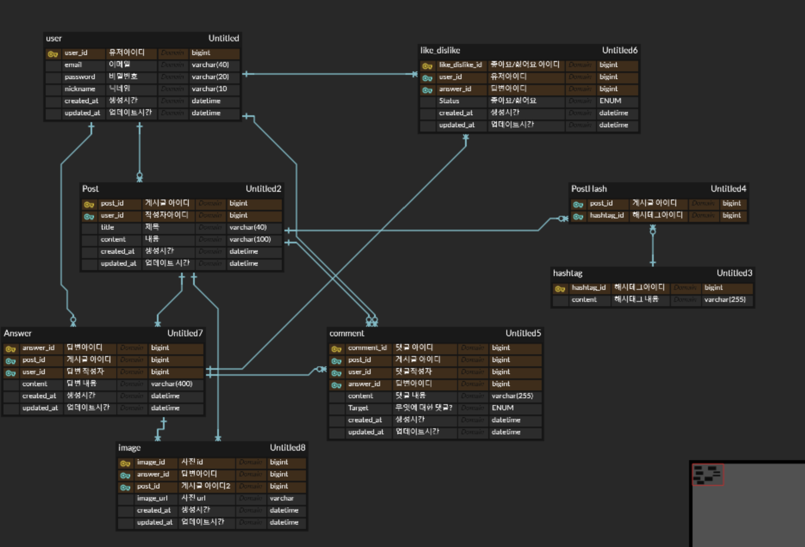
- 좋아요/싫어요는 답변 글에만 달 수 있도록 수정

### 구현 기능
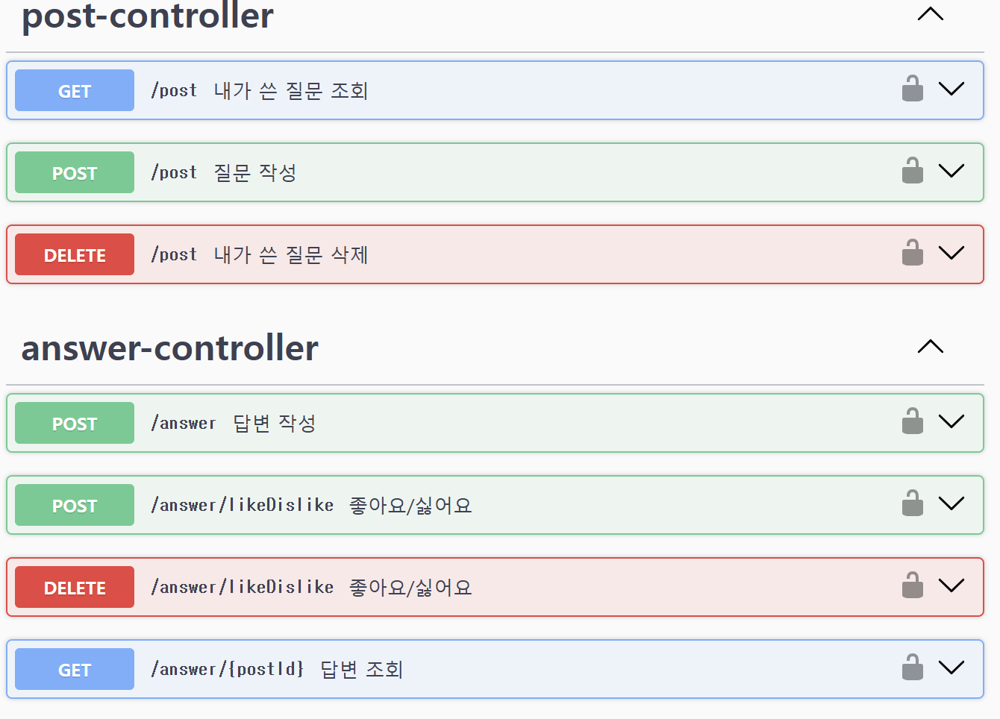

- User은 로그인 기능이 아직 없어 임의로 추가했습니다.
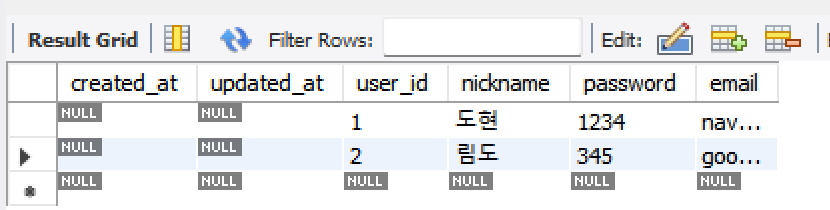
#### 1. 질문 작성
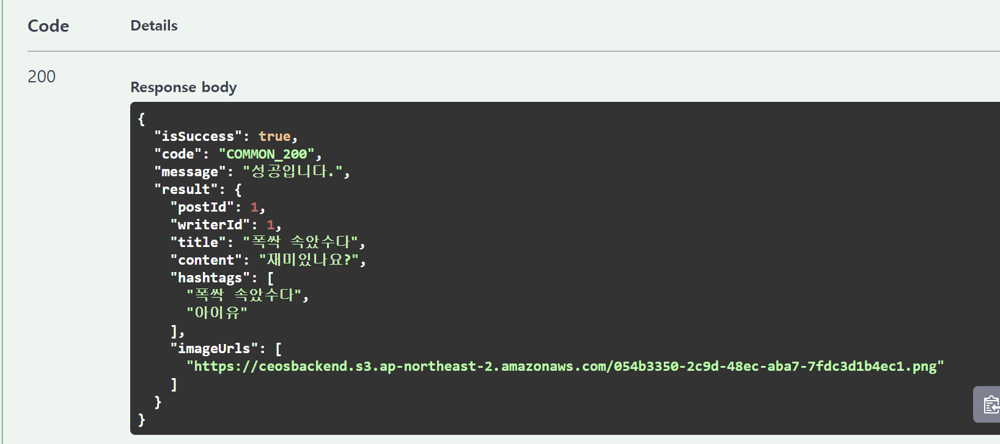
✨ **여기서 이미지는!! AWS S3 버킷 사용**
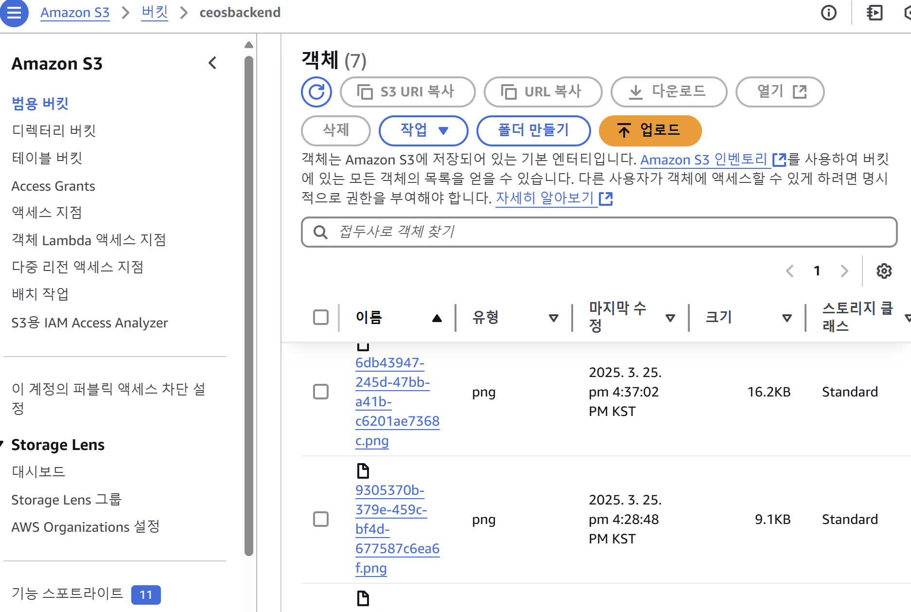
 - 버킷에 잘 들어갔지요~

#### 2. 내가 쓴 모든 질문글 조회
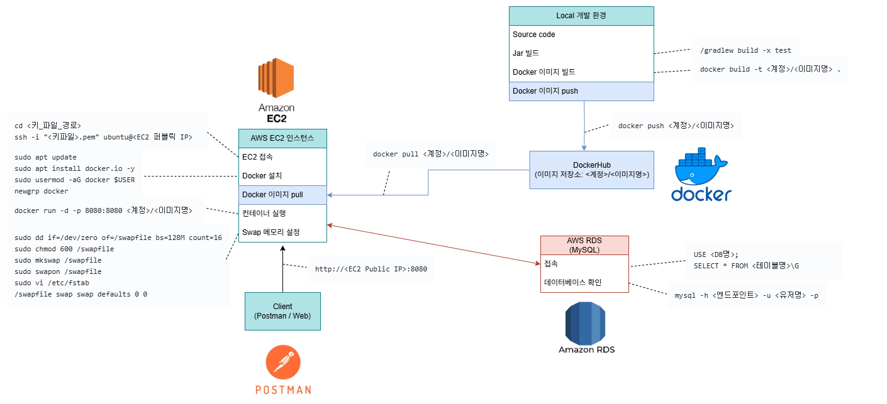

#### 3. 내가 쓴 질문글 삭제
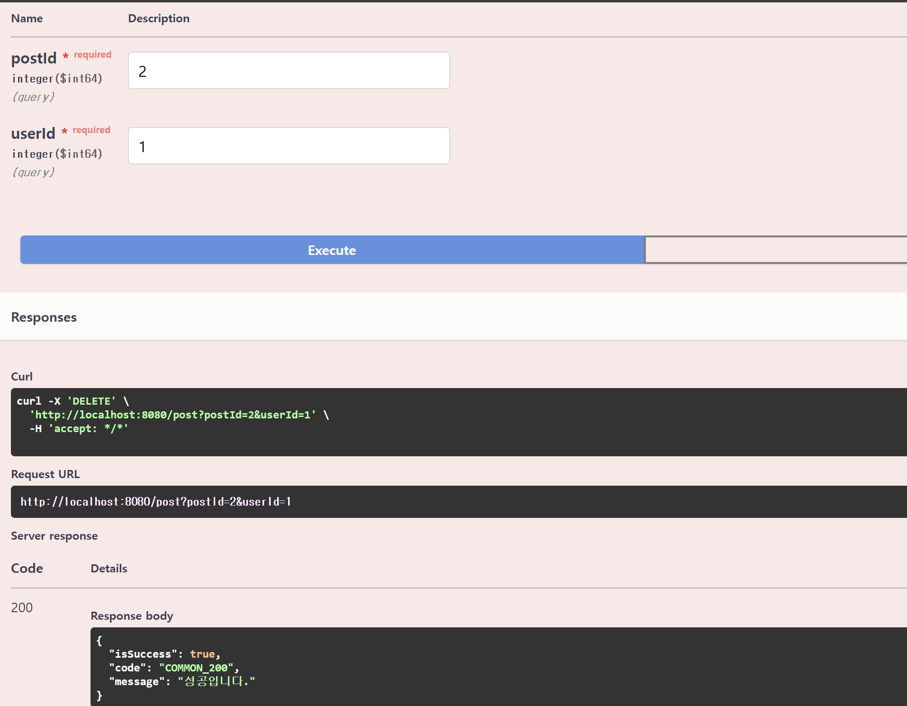
- 삭제 성공~

✨ 삭제하려는 userId와 질문 작성자가 다르면?
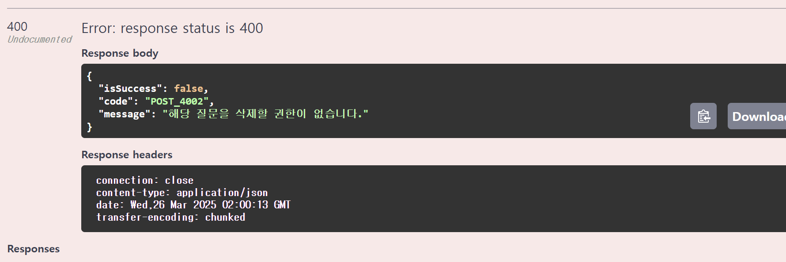
- 에러 발생!!

#### 4. 답변 작성
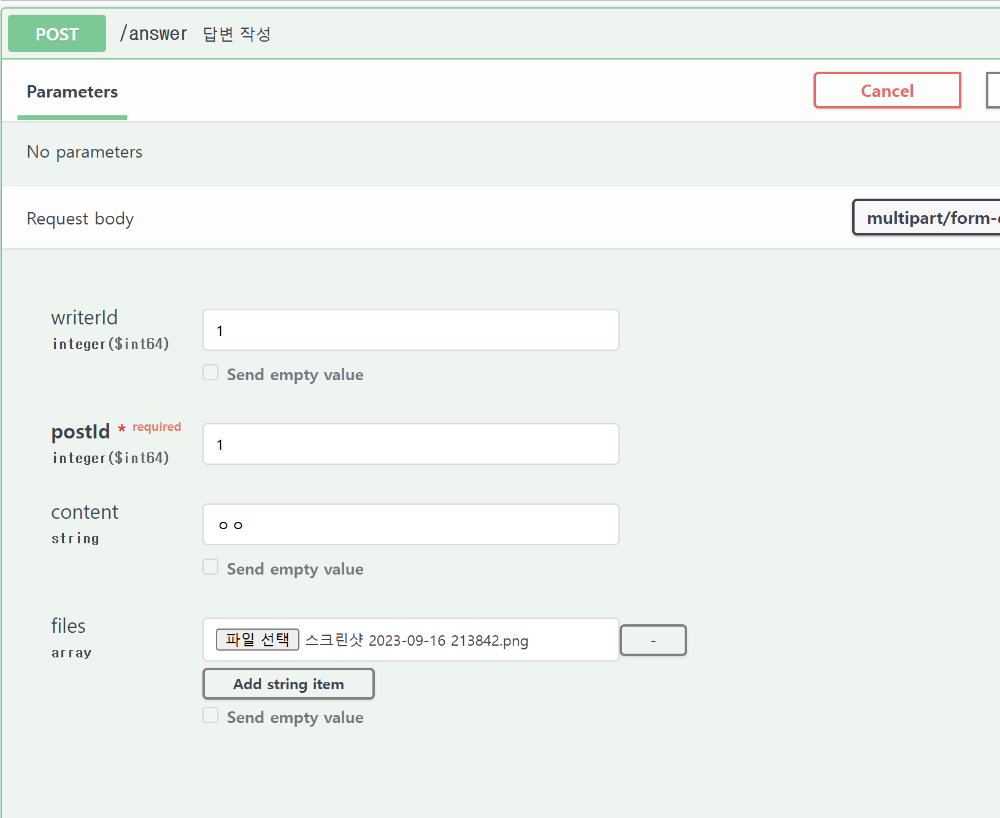
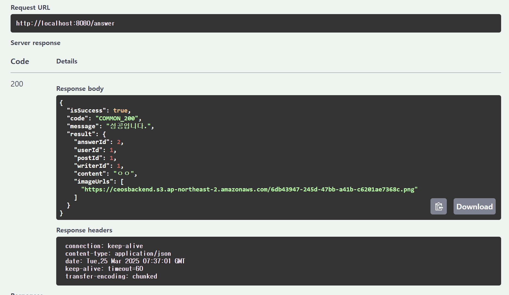

✨ 질문 작성자가 답변을 달려 하면?
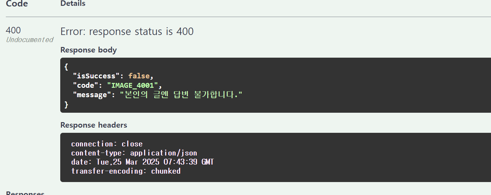
- 에러 발생 !!

#### 5. 질문과 답변 조회
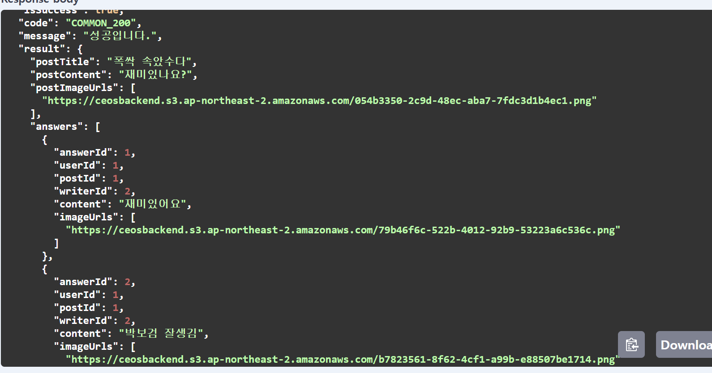
- postId를 PathParameter로 입력하면 그 질문과 답변글들을 조회 가능

#### 6. 좋아요/싫어요 달기
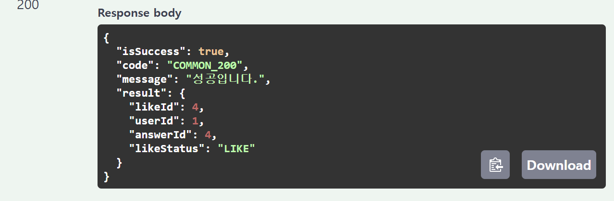
✨ 좋아요/싫어요 연타 방지를 어떻게 할까... 생각하다가 

(1) 좋아요-> 좋아요/ (2) 좋아요-> 싫어요/ (3) 싫어요-> 싫어요/(4) 싫어요->좋아요

모두 에러 처리 나도록 했습니다.

(1) 의 경우
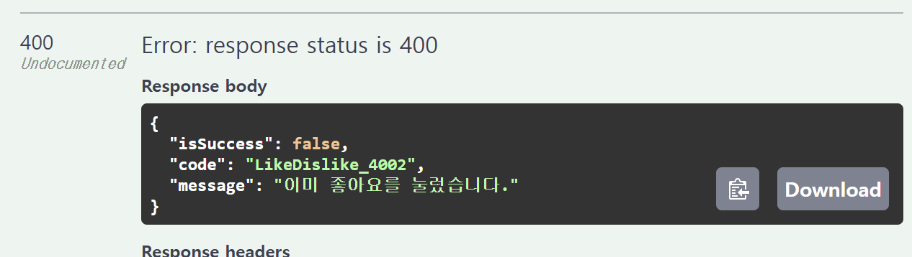

(2),(4)의 경우 
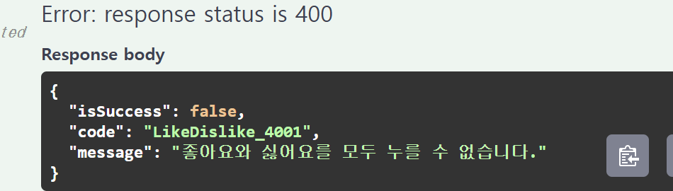

**결국, LIKE/DISLIKE가 있는 경우, 삭제한 후에만 새로 달 수 있습니다.**

#### 7. 좋아요/싫어요 삭제
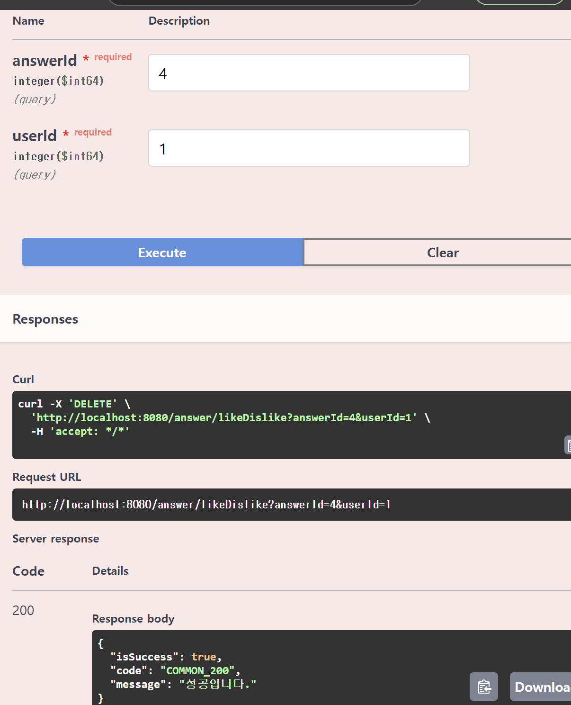

 ***

❔Hashtag를 이용한 질문글 찾기를 위해 HashtagController을 따로 둘지, PostController에 포함시킬지 고민중입니다. 어떻게 하셨나요❔

***
### 부가 구현 설명

**1. ErrorStatus + 성공 응답 처리**
 - exception과 ErrorStatus, SuccessStatus 등을 추가하였습니다. 
 - ErrorStatus에서는 에러 처리를 Custom하여 추가합니다.

**2. Swagger**
- SwaggerConfig를 이용한 Swagger 테스트 설정

**3. Converter**
- DTO <-> Entity 간 변환을 Converter에서 처리
- 서비스 로직의 간결성을 위해

**4. Service + ServiceImpl 사용**
- Service는 인터페이스 구현 + ServiceImpl은 비즈니스 로직 처리
- 확장성을 위해

**5. AWS S3 BUCKET 사용**
- 이미지 업로드를 위해 사용
- MultiPartFile 형식으로 이미지를 S3 버킷에 업로드 후, 이미지 URL을 반환하여 DB에 저장
