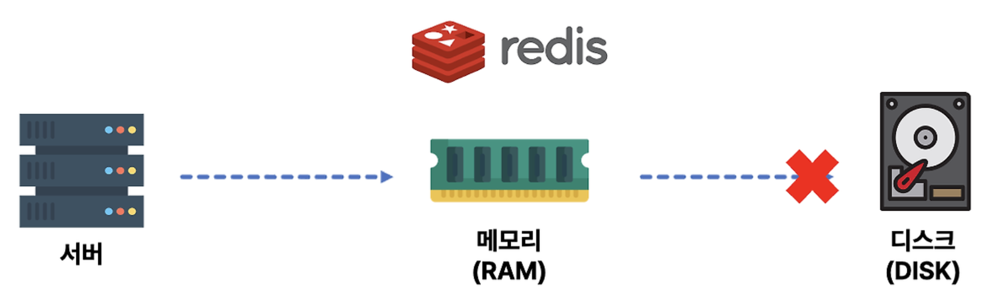
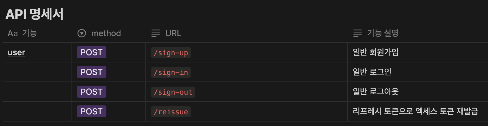
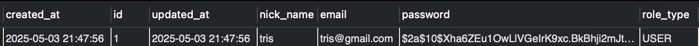

# spring-knowledgeIn-21st
ceos back-end 21st naver knowledge-in clone coding project

# Week2 

## 네이버 지식인 DB 모델링

### 요구 구현 기능

1. 게시글 조회
2. 게시글에 사진과 함께 글, 해시태그 작성하기
3. 게시글에 댓글 및 대댓글 기능
4. 게시글 댓글에 좋아요, 싫어요 기능
5. 게시글, 댓글, 좋아요 삭제 기능

### ERD Modeling


### 엔티티 관계

- User 1 — N Post
- User 1 — N Comment
- User 1 — N Reaction (리액션 삭제 기능이 있으려면 유저와 연결되어 있어야 할듯)
- Post 1 — N Image
- Post 1 — N PostHashtag
- Post 1 — N Comment
- Post 1 — N Reaction
- Hashtag 1 — N PostHashtag
- Comment 1 — N Reaction

### 엔티티 설명

- common > BaseEntity
    - createdAt, updatedAt 필드를 User, Post, Comment, Reaction에 적용

    ```jsx
    @MappedSuperclass
    @EntityListeners(AuditingEntityListener.class)
    @Getter
    public abstract class BaseEntity {
        @CreatedDate
        @Column(columnDefinition = "DATETIME")
        private LocalDateTime createdAt;
    
        @LastModifiedDate
        @Column(columnDefinition = "DATETIME")
        private LocalDateTime updatedAt;
    }
    ```

    - `@MappedSuperclass`
        - 객체의 입장에서 공통 매핑 정보가 필요할 때 사용
        - 공통 매핑 정보를 포함한 부모 클래스를 선언하고 속성만 상속 받아서 사용하고 싶을 때 사용함

          

        - Reference: [MappedSuperClass](https://ict-nroo.tistory.com/129)
    - `@EntityListeners(AuditingEntityListner.class)`
        - SpringBootApplication에 `@EnableJpaAuditing` 어노테이션을 붙여줘야 함
        - Auditing 기능을 사용할 수 있도록 함 → 엔티티가 생성되고, 변경되는 그 시점을 감지하여 생성시각, 수정시각, 생성한 사람, 수정한 사람을 기록할 수 있음
- User
    - 유저의 정보
    - 이후 로그인 기능 추가할때 password 및 보안 관련 필드 추가 예정
- Post
    - 게시물 정보
- Image
    - 게시물의 사진 URL 저장
- mapping > PostHashtag
    - 게시물과 해시태그의 매핑 엔티티
    - Post와 Hashtag가 N:M 관계인데 DB 모델링에서 지양해야하므로 사이에 mapping entity를 둬서 1:N, 1:M 관계로 매핑함
- Hashtag
    - 게시물에 붙일 해시태그 정보
    - 해시태그의 성격에 따라서 Enum, Varchar 타입으로 할지 정해야 할듯 (정형화된 태그면 Enum으로)
- Comment
    - 댓글 정보
    - 대댓글 기능
        - 부모 댓글에 자식 댓글들이 달리는 구조 → 1 : N

        ```jsx
        @ManyToOne(fetch = FetchType.LAZY)
        @JoinColumn(name = "parent_comment_id")
        private Comment parentComment; // Default로 nullable
        
        @OneToMany(mappedBy = "parentComment", cascade = CascadeType.ALL)
        private List<Comment> childrenCommentList = new ArrayList<>();
        ```

        - `parentComment`: 이 값이 `null`이면 부모 댓글임
        - `childrenCommentList`: 부모 댓글에 대한 대댓글들
        - Reference1: [대댓글 reference 1](https://velog.io/@ssm2053/Spring-%EB%8C%93%EA%B8%80%EC%9D%98-%EB%8B%B5%EA%B8%80-%EA%B8%B0%EB%8A%A5-%EA%B5%AC%ED%98%84-%EB%8C%80%EB%8C%93%EA%B8%80-%EA%B8%B0%EB%8A%A5-%EA%B5%AC%ED%98%84)
        - Reference2: [대댓글 reference 2](https://velog.io/@hhss2259/%EB%8C%80%EB%8C%93%EA%B8%80-%EB%8C%93%EA%B8%80%EC%9D%98-%EB%8C%93%EA%B8%80-%EA%B8%B0%EB%8A%A5-%EA%B5%AC%ED%98%84%ED%95%98%EA%B8%B0)
- Reaction
    - 댓글/게시물에 반응
    - enums > ContentType, enums > ReactionType

    ```jsx
    public enum ContentType {
        POST, COMMENT, NONE
    }
    
    public enum ReactionType {
        LIKE, UNLIKE, NONE
    }
    ```

    - `@DynamicInsert`, `@DynamicUpdate`
        - Hibernate(Spring JPA 구현체)는 엔티티를 데이터베이스에 등록하거나 데이터베이스에 있는 엔티티를 수정할 때 엔티티의 모든 필드를 업데이트 하는 방식으로 이루어짐
        - 굳이 모든 필드 수정이 필요없다면 실제 등록되거나 수정되는 칼럼에 대한 쿼리에 대해서만 insert 및 update를 해주도록 위의 어노테이션 사용
        - 칼럼에 디폴트 값을 설정하고 싶을 때 사용 가능

            ```jsx
            @Enumerated(EnumType.ORDINAL)
            @Column(columnDefinition = "VARCHAR(10) DEFAULT 'NONE'")
            private ContentType contentType;
            
            @Enumerated(EnumType.ORDINAL)
            @Column(columnDefinition = "VARCHAR(10) DEFAULT 'NONE'")
            private ReactionType reactionType;
            ```

        - Refrence: [DynamicInsert, DynamicUpdate](https://velog.io/@choidongkuen/JPA-%ED%94%84%EB%A1%9C%EA%B7%B8%EB%9E%98%EB%B0%8D-DynamicInsert-DynamicUpdate-%EC%97%90-%EB%8C%80%ED%95%B4-%EC%95%8C%EC%95%84%EB%B4%85%EC%8B%9C%EB%8B%A4)

### DB 생성 - 화긴


---

## Repository 단위 테스트

### Post Repository Test

```jsx
@SpringBootTest
public class PostRepositoryTest {
    @Autowired
    private PostRepository postRepository;
    @Autowired
    private UserRepository userRepository;

    @Test
    //@Transactional
    //@Rollback(false)
    void storePostTest() {
        // Post 저장 테스트

        // given - 유저 생성
        // ~~~(생략)
        
        // when - 포스트 생성
        // ~~~(생략)
        
        // then - 저장된 게시물 조회
        List<Post> postList = postRepository.findAll();

        Assertions.assertEquals(3, postList.size());

        postList.forEach(post -> {
            System.out.println("Post: " + post.getTitle());
            System.out.println("Writer: " + post.getUser().getNickname());
        });

    }
}

```


### `@SpringBootTest` vs `@DataJpaTest`

- `@SpringBootTest`
    - 스프링의 전체 애플리케이션 컨텍스트를 로드
    - `application.yml` 파일의 DB 설정으로 세팅해주며 mySQL도 지원 → so 이거 사용
    - 자동 rollback 지원 안하지만 `@SpringBootTest` + `@Transactional` 로 rollback 사용 가능
- `@DataJpaTest`
    - JPA 관련 컴포넌트(@Entity, Repository)만 로드하여 주로 DB 접근 레이어(Repository)만 테스트함
    - `application.yml` 파일의 DB 설정을 무시하고 h2 DB로 실행 → mySQL 지원 x ㅠㅠ
    - 자동으로 rollback 됨 (내부에 rollback 로직 포함) → rollback 안하려면 `@rollback(false)` 설정
  
---
## ReactionType에 None이 있는 이유

```jsx
public enum ReactionType {
    LIKE, UNLIKE, NONE
}
```

- `NONE` 옵션을 추가하여 soft delete 가능하도록 처리
- 좋아요/싫어요 클릭 특성상 여러번 연타하는 경우가 생길 수 있는데 그럴때마다 delete 쿼리를 날리는 것은 비효율적임
- Q. 하지만 db에 `NONE` 값을 가진 데이터가 쌓이는건 어떻게 해결할건지? 스케줄러 요청을 통해 `NONE`값을 오래동안 가지고 있는 데이터를 주기적으로 clean up

## 맵핑 엔티티에 기본키 vs 복합키

- 복합키를 사용하면 save를 여러번 해도 키의 중복을 막을 수 있으나 좀 더 복잡하고 만일 맵핑 엔티티에 속성이 추가된다면 불편해진다는 단점이 있음

### 기본키 방식: `@Table`의 `@UniqueConstraints` 조건

- 기존 엔티티 형식을 유지하면서 복합키의 장점인 중복키를 철저하게 배제하는 방법은?
- `@Table`의 `@UniqueConstraints` 조건 사용해서 복합적인 유니크 키를 정의한다!

    ```jsx
    @Table(
        name = "post_hashtag",
        uniqueConstraints = {
            @UniqueConstraint(columnNames = {"post_id", "hashtag_id"})
        }
    )
    public class PostHashtag {
    	...
    }
    ```

- Reference Doc: [복합키 맵핑](https://velog.io/@dev_hammy/Defining-Unique-Constraints-in-JPA)

### 복합키 방식: `@EmbeddedId`를 활용한 복합키 맵핑

- **@EmbeddedId** 를 적용한 식별자 클래스(ex.`PostHashtagId` 클래스) 조건
    - Serializable 인터페이스 구현
    - 기본 생성자 꼭 필요; `@NoArgsContructor(access = AccessLevel.PROTECTED)`
    - Public class여야함

        ```jsx
        @Getter
        @Embeddable
        @NoArgsContructor(access = AccessLevel.PROTECTED)
        @AllArgsContructor
        public class PostHashtagId implements serializable {
        		@Column(name = "post_id")
            private Long postId;
        
            @Column(name = "hashtag_id")
            private Long hashtagId;
        }
        ```

        ```jsx
        @Entity
        @Getter
        @NoArgsConstructor(access = AccessLevel.PROTECTED)
        @AllArgsConstructor
        public class PostHashtag {
        
            @EmbeddedId
            private PostHashtagId id;
            
            ...
        }
        ```


## 네이버 지식인 구조 확인

### Question & Answer 구조

- 지식인 구조를 확인해보니 Q&A 형식으로 Question, Answer 모두 Post 형식임을 확인
- Question에는 Comment가 아닌 Answer이 달리고 Answer에 Comment가 달리는 형식
- Question에는 Reaction 달릴 수 없음

### 수정 사항

- Post에 postType 필드 추가

    ```jsx
    public enum PostType {
        QUESTION, ANSWER;
    }
    ```

- Post 1 : N Post 관계 추가 → PostType이 Question인 경우만 Answer을 받을 수 있도록 구현해야함
- Commet 1 : N Comment 관계 삭제 → Comment는 Post 타입에 달리는 댓글
- Comment의 ContentType Enum 필드 삭제
- Comment 1 : N Reaction 관계 삭제 → 좋아요/싫어요는 Post의 Answer 타입에 달리는 반응


---
# Week3

## 지식인의 4가지 HTTP Method API 구현


### 새로운 Post 생성

- PostType에 따른 생성 과정 차이
    - `postType == PostType.QUESTION`
        - `questionId` 필드가 `null`이어야 함
        - Request & Response

            ```jsx
            {
              "questionId": null,
              "userId": 1,
              "postType": "QUESTION",
              "title": "잠깨고 싶어요",
              "content": "잠을 어떻게 깨나요.. 졸려요",
              "hashtagList": ["#잠", "#궁금", "#긴급"],
              "imageList": ["https://ceos-knowlege-in.s3.ap-northeast-2.amazonaws.com/question-image.png"]
            }
            
            {
              "isSuccess": true,
              "code": "COMMON200",
              "message": "성공입니다.",
              "result": {
                "postId": 1,
                "createdAt": "2025-03-30T00:27:54.818197"
              }
            }
            ```

    - `postType == PostType.ANSWER`
        - `questionId` 필드가 `null`이 아니어야 하고 해당 id의 부모 post가 존재해야 함
        - 부모글은 question type이어야 함
        - 해당 question post의 `AnswerPostList`에 추가되어야 함
        - Request & Response

            ```jsx
            {
              "questionId": 1,
              "userId": 2,
              "postType": "ANSWER",
              "title": "잠깨는 방법",
              "content": "잠을 효과적으로 깨기 위해서는 아아를 마셔야해요",
              "hashtagList": ["#잠", "#만능", "#아아"],
              "imageList": []
            }
            
            {
              "isSuccess": true,
              "code": "COMMON200",
              "message": "성공입니다.",
              "result": {
                "postId": 2,
                "createdAt": "2025-03-30T00:30:37.468488"
              }
            }
            ```


```java
if (request.getPostType() == PostType.QUESTION) {
    if (request.getQuestionId() != null) throw new GeneralException(ErrorStatus.QUESTION_SHOULD_NOT_EXIST);
} else {
    // request.getPostType() == PostType.ANSWER
    if (request.getQuestionId() == null) throw new GeneralException(ErrorStatus.QUESTION_SHOULD_EXIST);
    question = postRepository.findById(request.getQuestionId())
            .orElseThrow(() -> new GeneralException(ErrorStatus.PARENT_QUESTION_NOT_FOUND));
    if (question.getPostType() != PostType.QUESTION) throw new GeneralException(ErrorStatus.PARENT_IS_A_QUESTION);
}

// newPost 객체 생성 후

if (request.getPostType() == PostType.ANSWER) {
    question.addAnswerPost(newPost);
}
```

- 결과
    - Post: `QUESTION` 타입은 `questionId` 필드가 비어있고, 하나의 질문에 여러개의 답글이 달릴 수 있음을 확인
      
  
    - Hashtag: `tag` 필드에 `@Column(nuique = true)`를 해주니 겹치는 해시태그는 한번만 나옴 (PostHashTag 테이블 보면 맵핑은 잘 되어있는거 확인 가능)
    
    - 
     
    - Image: `image_url` 필드에 사진 url이 잘 올라가는 것을 확인할 수 있음 (사진 업로드는 aws s3 버킷 사용)
      
  
        - Reference Doc1: [aws s3 bucket](https://velog.io/@jinseoit/AWS-S3-bucket)
        - Refrence Doc2: [aws s3 bucket troubleshooting](https://velog.io/@ino5/S3-%EB%B2%84%ED%82%B7-%EC%A0%95%EC%B1%85-%EC%84%A4%EC%A0%95-%EC%8B%9C-Action-does-not-apply-to-any-resources-in-statement-%EC%97%90%EB%9F%AC)
        - Uploaded Pic: [uploaded pic](https://ceos-knowlege-in.s3.ap-northeast-2.amazonaws.com/question-image.png)

### Post List 조회

- 임의로 게시물 5개씩 페이지 구성하도록 구현(+질문만 모아서 볼 수 있도록 하는 기능을 추가해도 좋을 것 같다)
- Custom Annotation 생성: `@CheckPage`
    - 사용자 기준으로는 1이 첫 페이지지만 `Pageable` 객체는 0부터 시작하므로 이를 체크하고 조정해주는 validation을 주로 사용

    ```java
    @Documented
    @Constraint(validatedBy = PageCheckValidator.class)
    @Target({ElementType.METHOD, ElementType.FIELD, ElementType.PARAMETER})
    @Retention(RetentionPolicy.RUNTIME)
    public @interface CheckPage {
        String message() default "페이지 번호는 1 이상이어야 합니다.";
        Class<?>[] groups() default {};
        Class<? extends Payload>[] payload() default {};
    }
    
    public class PageCheckValidator implements ConstraintValidator<CheckPage, Integer> {
        @Override
        public boolean isValid(Integer page, ConstraintValidatorContext context) {
            if (page == null || page <= 0) {
                return false;
            }
    
            // 검증을 통과한 경우, 값 조정 (1 -> 0)
            if (page == 1) {
                context.disableDefaultConstraintViolation();
                context.buildConstraintViolationWithTemplate("페이지 번호를 0으로 변경했습니다.")
                        .addConstraintViolation();
            }
    
            return true;
        }
    }
    
    // 사용 at PostRestController
    public ApiResponse<PostResponseDTO.PreviewListDto> getPage(@CheckPage @RequestParam(name = "page") Integer page)
    ```

- 결과

    ```jsx
    {
      "isSuccess": true,
      "code": "COMMON200",
      "message": "성공입니다.",
      "result": {
        "previewList": [
          {
            "postId": 1,
            "userId": 1,
            "questionId": null,
            "postType": "QUESTION",
            "title": "잠깨고 싶어요",
            "createdAt": "2025-03-30T00:27:55"
          },
    			// 생략 ... 
          {
            "postId": 5,
            "userId": 2,
            "questionId": 4,
            "postType": "ANSWER",
            "title": "참나",
            "createdAt": "2025-03-30T00:54:57"
          }
        ],
        "listSize": 5,
        "totalPage": 2,
        "totalElements": 6,
        "isFirst": true,
        "isLast": false
      }
    }
    ```


### 특정 Post 조회

- Id 값으로 특정 post를 조회
- 리스트 조회와 마찬가지로 게시물의 preview를 조회
- 결과

    ```jsx
    {
      "isSuccess": true,
      "code": "COMMON200",
      "message": "성공입니다.",
      "result": {
        "postId": 4,
        "userId": 1,
        "questionId": null,
        "postType": "QUESTION",
        "title": "노래가 너무 좋아요",
        "createdAt": "2025-03-30T00:42:46"
      }
    }
    ```


### 특정 Post 삭제

- Soft Delete? Nope
    - Soft Delete를 고민했지만 기존 셜계대로 쿼리를 날려 Delete하는 방식을 택함
    - Soft Delete는 리액션 기능에 필요한 사항이고 게시물에 관해서는 굳이 필요하다고 느껴지지는 않았음
- AnswerPostList의 객체들 삭제 방법
    1. `orphanRemoval = true` 옵션 사용
        - 이 옵션을 사용하면 Question Post 객체를 삭제할때 answerPostList의 객체들도 같이 삭제 가능

        ```java
        @OneToMany(mappedBy = "questionPost", cascade = CascadeType.ALL, orphanRemoval = true)
        @Builder.Default
        private List<Post> answerPostList = new ArrayList<>();
        ```

    2. 순회하며 확실히 삭제 → 택
        - 하나하나 삭제하는 방법으로 1번보다는 덜 효율적이지만 delete되는 객체들에 대한 로깅을 하고 싶을때 (확실히 하고 싶을떄) 사용하기 좋을 듯

        ```java
        if (post.getPostType() == PostType.QUESTION) {
            for (Post answer: post.getAnswerPostList()) {
                postRepository.delete(answer);
            }
        }
        ```

    - 결과
        - 질문글인 4번을 삭제했더니 4번에 대한 대답글이었던 5번과 6번도 함께 삭제되는 것 확인

        ```jsx
        {
          "isSuccess": true,
          "code": "COMMON200",
          "message": "성공입니다.",
          "result": [
            {
              "postId": 5,
              "createdAt": "2025-03-30T00:54:57"
            },
            {
              "postId": 6,
              "createdAt": "2025-03-30T00:55:25"
            },
            {
              "postId": 4,
              "createdAt": "2025-03-30T00:42:46"
            }
          ]
        }
        
        ```

### 특정 post 업데이트

- `PATCH` vs `PUT`
    - Reference Doc: [Patch vs Put](https://afuew.tistory.com/17)
    - `PUT`메서드
        - 자원이 존재하지 않는 경우: 새로운 자원을 저장
        - 자원이 존재하는 경우: 기존에 존재하는 자원을 새로운 자원으로 대체
        - → 리액션 기능에서 기존에 리액션을 했다면 리액션 상태만 변경인 것이고, 기존에 리액션을 하지 않았다면 리액션이 새로 생성
    - `PATCH` 메서드
        - `PUT`과 다르게 미리 자원이 존재해야함
        - → 미리 자원이 `POST`로 생성된 게시물, 유저 등의 내용을 일부 수정할때 사용
        - → 특정 post 업데이트는 이 경우에 해당!
- Hashtag의 orphan removal
    - Post와 1:N 관계인 엔티티는(ex. Image) `@OneToMany(orphanRemoval = true)` 설정을 해주면 Post 삭제 및 업데이트로 인해 Image가 사용이 되지 않으면 따라서 remove 되도록 해주지만 Hashtag는 N:M 관계이므로 따로 처리 필요

    ```java
    // For orphan removal
    List<Hashtag> originalHashtags = post.getPostHashtagList().stream()
            .map(PostHashtag::getHashtag)
            .collect(Collectors.toList());
            
    if (request.getHashtagList() != null) {
        post.clearPostHashtagList();
        for (String tag: request.getHashtagList()) {
            Hashtag hashtag = hashtagRepository.findByTag(tag)
                    .orElseGet(() -> hashtagRepository.save(HashtagConverter.toHashtag(tag)));
    
            PostHashtag postHashtag = PostHashtagConverter.toPostHashtag(post, hashtag);
            post.addPostHashtag(postHashtag);
        }
    
        // Orphan removal
        Set<String> updatedTagSet = new HashSet<>(Optional.ofNullable(request.getHashtagList()).orElse(List.of()));
    
        for (Hashtag oldTag : originalHashtags) {
            if (!updatedTagSet.contains(oldTag.getTag())) {
                if (oldTag.getPostHashtagList().size() <= 1) {
                    hashtagRepository.delete(oldTag);
                }
            }
        }
    }
    ```

- Request & Response

    ```jsx
    {
      "questionId": 1,
      "userId": 2,
      "postType": "ANSWER",
      "title": "잠깨는 방법 (2)",
      "content": "사실은 사과가 더 효과적이래요",
      "hashtagList": ["#잠", "#만능", "#사과"],
      "imageList": []
    }
    
    // postId: 3, userId: 2
    {
      "title": "다시다시 말해드릴게요",
      "content": "잠을 효과적으로 깨기 위해서는 그냥 찬물을 마시면 된답니다",
      "hashtagList": ["#잠", "#만능", "#찬물"],
      "imageList": []
    }
    
    // Response
    {
      "isSuccess": true,
      "code": "COMMON200",
      "message": "성공입니다.",
      "result": {
        "postId": 3,
        "title": "다시다시 말해드릴게요",
        "content": "잠을 효과적으로 깨기 위해서는 그냥 찬물을 마시면 된답니다",
        "hashtagList": [
          "#잠",
          "#만능",
          "#찬물"
        ],
        "imageList": []
      }
    }
    ```

- 결과
    - Post table: `PostId=3` 수정됨

  

    - Hashtag table: `#사과` 사라짐
  
        
      
---
## Service 계층의 단위 테스트

- `@BeforeEach` 사용
    - Test가 두개 있는데 각 test 실행 전에 user, post 객체 생성 위해 사용
    - Reference Doc: [@BeforeEach 사용](https://mimah.tistory.com/entry/Spring-Boot-AfterEach-BeforeEach-%EC%98%88%EC%A0%9C)
- 특정 게시글 조회 성공 & 특정 게시글 조회 실패 테스트 → 성공
    - 실패 테스트는 에러 코드 비교 (`ErrorStatus.POST_NOT_FOUND`가 나오도록)

---
# Week4 Submission

## 스프링 시큐리티 (Spring Security)

### Spring Security 핵심 기능

- 핵심 기능
    - Authentication (인증): 누가 들어오는지 확인
    - Authorization (인가): 들어온 사람이 어디에 갈 수 있는지 결정
    - 다양한 보안 위협 방어

- Authentication (인증)
    - 사용자가 제공한 credential (아이디, 비번 등)을 확인하여 신원 검증
    - `Authentication` 인터페이스: 인증된 사용자의 정보를 담음

    ```java
    public interface Authentication extends Principal, Serializable {
        Collection<? extends GrantedAuthority> getAuthorities();
        Object getCredentials();
        Object getDetails(); 
        Object getPrincipal(); 
        boolean isAuthenticated();
        void setAuthenticated(boolean isAuthenticated) throws IllegalArgumentException;
    }
    ```

    - `getAuthorities()`: “이 사람이 어떤 정보를 가졌냐?”에 해당, 역할/권한 반환
    - `getPrincipal()`: “누구냐?”에 해당, 사용자 ID, username, 또는 UserDetails 객체 전체 등을 반환

- Authorization (인가)
    - 인증된 사용자가 특정 리소스에 접근할 수 있는지, 특정 동작을 수행할 수 있는지를 결정

### Spring Security 주요 컴포넌트

- `AuthenticationManager`
    - Authentication 과정을 관리하는 중심 컴포넌트
    - 사용자가 로그인을 시도할 때, `AuthenticationManager`가 사용자의 자격 증명 (이메일, 비밀번호 등)을 받아 이를 인증할 수 있는 프로세스를 호출

      

- `AuthenticationProvider`
    - 실제로 인증 로직을 처리하는 역할을 담당
    - 여러 `AuthenticationProvider`가 존재할 수 있으며, 각각은 특정 인증 방식을 처리
        - 이메일, 비번을 하나의 `AuthenticationProvider`에서 처리하고, 다른 소셜 로그인은 또다른 `AuthenticationProvider`에서 담당하는 방식

          

- `UserDetailsService`
    - 사용자 정보를 불러오고 검증하는 서비스
    - 데이터베이스 또는 다른 저장소에서 사용자 정보를 가져오고, 이를 `UserDetails` 객체로 반환
    - `UserDetails` 객체: 사용자의 아이디, 비밀번호, 권한(Role) 등 다양한 정보를 포함

- `SecurityContext`
    - 인증이 완료된 사용자 정보를 저장하는 컨텍스트
    - 애플리케이션 전반에서 공유되며 `SecurityContextHolder`로 접근 가능

      

- `SecurityContextHolder`
    - 현재 보안 컨텍스트에 대한 세부 정보를 보관
    - `ThreadLocal`을 사용하여 동일한 스레드 내에서는 각 사용자의 인증 정보를 개별적으로 유지
    - → 요청마다 인증된 사용자의 정보를 보존하고, 다른 요청에서는 다른 사용자의 정보 처리 가능
    1. 인증된 사용자 정보를 `SecurityContext`에 저장 및 관리
    2. 이후 요청에서 `SecurityContext`를 통해 인증된 정보를 참조하여 사용자의 권한이나 인증 상태를 확인
    3. 애플리케이션 어디서나 `SecurityContextHolder.getContext()` 메서드를 통해 인증 정보 접근 가능

        ```java
        Authentication authentication 
        		= SecurityContextHolder.getContext().getAuthentication();
        		
        String username = authentication.getName();  // 사용자 이름
        Object principal = authentication.getPrincipal();
        Collection<? extends GrantedAuthority> authorities 
        		= authentication.getAuthorities();  // 권한 목록
        ```


### Spring Security Filter Chain

- Filter Chain
    - Spring Security에서 HTTP 요청을 처리할 때 사용하는 일련의 필터들
    - 각 필터 → 특정 보안 기능 담당
    1. `SecurityContextPersistenceFilter`
        - 요청 간 `SecurityContext`(얘가 뭐냐고? 인증이 완료된 사용자 정보를 저장하는 컨텍스트) 유지
        - 새 요청이 들어오면 이전 인증된 사용자 정보 복원
    2. `UsernamePasswordAuthenticationFilter`
        - 폼 기반 로그인 처리
        - 사용자가 제출한 username과 pw를 확인하여 인증 시도

        ```java
        SecurityContextHolder.getContext().getAuthentication()
        → UsernamePasswordAuthenticationToken
        → principal = User 객체
        → authorities = [ROLE_USER]
        ```

    3. `AnonymousAuthenticationFilter`
        - 이전 필터에서 인증되지 않은 요청에 대해 익명 사용자 인증 제공
        - 로그인 안 한 유저에 대해서 `SecurityContext`에 anonymous user로 저장됨

        ```java
        SecurityContextHolder.getContext().getAuthentication()
        → AnonymousAuthenticationToken
        → principal = "anonymousUser"
        → authorities = [ROLE_ANONYMOUS]
        ```

    4. `ExceptionTranslationFilter`
        - Spring Security 예외를 HTTP 응답으로 변환
        - 인증 실패 → 로그인 페이지로 리다이렉트 OR 인가 실패 → 403 오류
    5. `FilterSecurityInterceptor`
        - 접근 제어 결정을 내리는 마지막 필터
        - 현재 인증된 사용자가 요청한 리소스에 접근할 권한이 있는지 확인

- Filter Chain 동작 방식
    1. 클라이언트 요청 들어옴 → Filter Chain의 첫 번째 필터부터 순차적으로 통과
    2. 각 필터는 요청을 검사하고 작업 수행
    3. 필터는 요청을 다음 필터로 전달하거나 특정 조건에 따라 요청 처리 중단
    4. 모든 필터를 통과한 요청만이 실제 애플리케이션 로직에 도달

       

### Spring Security 인증, 인가 흐름


- Authentication (인증) 흐름
    - 사용자의 신원을 확인하는 과정
    1. **사용자 로그인 요청**: 사용자가 로그인 폼에 credentials(이메일, 비밀번호 등)을 입력하고 제출
    2. **Authentication Filter**:  `UsernamePasswordAuthenticationFilter`가 요청을 가로채고 `Authentication` 객체 생성
    3. **Authentication Manager**: `AuthenticationManager`은 적절한 `AuthenticationProvider`을 선택하여 인증을 위임 (`AuthenticationManager`가  `AuthenticationProvider`의 parent 관계)
    4. **Authentication Provider**: 선택된 `AuthenticationProvider`은 `UserDetailsService`를 사용하여 사용자 정보를 로드하고 로드된 정보를 바탕으로 비밀번호 검증 (얘가 실제 인증 로직을 처리하니까)
    5. **User Details Service**: 데이터베이스나 다른 저장소에서 사용자 정보 조회
    6. **Security Context**: 인증이 성공하면, `Authentication` 객체가 `SecurityContext`에 저장됨

- Authorization (인가) 흐름
    - 인증된 사용자가 특정 리소스에 접근할 권한이 있는지 확인하는 과정
    1. **리소스 접근 요청**: 인증된 사용자가 보호된 리소스에 접근 시도
    2. **Filter Security Interceptor**: `FilterSecurityInterceptor`가 요청을 가로채고 권한 검사를 시작
    3. **Access Decision Manager**: `AccessDecisionManager`가 현재 사용자의 권한과 요청된 리소스의 필요 권한 비교
    4. **권한 확인**: `SecurityContext`에서 현재 인증된 사용자의 권한 정보 조회
    5. **접근 결정**: 사용자의 권한이 충분하면 리소스 접근이 허용되고, 권한이 부족하면 `AccessDeniedException`이 발생하고 접근 거부됨


### Spring Security 관련 Dependencies

```groovy
dependencies {
		implementation 'org.springframework.boot:spring-boot-starter-security'
		testImplementation 'org.springframework.security:spring-security-test'
}
```

- Dependencies만 추가해도 `localhost:8080/login`으로 로그인 테스트 가능

  

## JWT 인증(Authentication)

- Dependencies 추가

    ```jsx
    // jtw dependencies
    implementation 'io.jsonwebtoken:jjwt-api:0.12.6'
    runtimeOnly 'io.jsonwebtoken:jjwt-impl:0.12.6'
    runtimeOnly 'io.jsonwebtoken:jjwt-jackson:0.12.6'
    ```

- `application.yml`에 다음 사항 추가

    ```json
    jwt:
    	secret: ${jwt_secret} // 터미널에 openssl rand -hex 64 입력하면 생성해줌
    ```


- JWT 구성요소

  
    - Header: 어떠한 알고리즘으로 암호화 할 것인지, 어떠한 토큰을 사용할 것 인지
    - Payload: 전달하려는 정보
    - Signature: 헤더와 페이로드를 합친 후 서버가 지정한 secret key로 암호화 시켜 토큰을 변조하기 어렵게 만듦
- JWT 동작 원리

  
    1. 사용자 id, pw 입력하여 로그인 요청
    2. 서버는 회원DB에 사용자가 있는지 확인
    3. 사용자의 로그인 요청 확인 후 secret key로 토큰 발급
    4. 토큰을 사용자에 전달
    5. 서비스 요청 및 권한 확인 위하여 헤더에 데이터 요청
    6. 데이터 확인 후 Access token으로 사용자 정보 확인
    7. 클라이언트 요청에 대한 응답과 요청한 데이터 전달

- `CustomUserDetails`
    - 사용자 인증 객체 정의; 우리의 User 객체와 Spring Security 보안 시스템을 연결해줌
    - Spring Security에서 로그인한 사용자 정보를 담는 객체 (User 객체와의 중간다리 역할)
- `JwtAuthenticationFilter`
    - 모든 HTTP 요청에 대해 JWT 토큰을 검증하고 인증 객체를 Security Context에 설정하는 역할
- `TokenProvider`
    - createAccessToken()
        - 액세스 토큰 생성 (24시간 유효)
        - 토큰에 사용자 email + Role 포함
    - createRefreshToken()
        - 리프레시 토큰 생성 (1주일 유효)
        - 토큰에 사용자 email 포함
    - getEmailFromToken()
        - JWT에서 email(subject) 추출
    - getAuthentication()
        - JWT 기반으로 Authentication 객체 생성
    - validateToken()
        - 토큰 유효성 검사
        - 로그아웃 여부 검사 - Redis에 블랙리스트로 저장된 토큰인지 확인
    - reissue()
        - 토큰 재발급
        - 리프레시 토큰의 만료일이 엑세스 토큰보다 빠르면 리프레시 토큰도 갱신

## Redis 사용

- Dependencies 추가

    ```jsx
    // redis dependencies
    implementation 'org.springframework.boot:spring-boot-starter-data-redis'
    ```

- `redis-server`로 터미널에서 Redis 실행하고 `application.yml`에 다음 사항 추가

    ```json
    data:
      redis:
      host: localhost
      port: 6379 // 기본 포트 번호
    ```


- 캐시 서버 (Cache Server)
    - 사용자가 많아지게 된다면 데이터베이스가 과부하 위험 → 캐시 서버(Redis) 사용!
    - 같은 요청이 여러번 들어오면 캐시 서버에 저장되어있는 이전 요청 결과값을 바로 내려줄 수 있음 → DB 부하 줄이고 서비스 속도 느려지지 않도록 해줌

- Redis (Remote Dictionary Server)
    - 디스크나 SSD가 아닌 메모리에 데이터를 저장하는 인메모리 NoSQL Key-Value 저장소
    - Data type (Collection) 지원

- Redis Session Clustering
    - 모든 서버가 같은 Redis Session 저장소를 바라보게 하는 방법 → 외부로 Session 저장소를 분리
    - 하나의 서버에서 세션이 생성될 때 한 번만 저장소에 저장 → 메모리 부하 절감
    - 세션 저장소는 서버에 상태(state)를 저장하므로 저장소 접근이 잦음 → Redis는 인메모리 방식이라 메모리 낭비를 줄일 수 있음

      
      
    - Reference: [redis session clustering](https://ksh-coding.tistory.com/128)


## JWT with Redis

- JWT의 장점
    - 서버에 메모리에 저장하는 방식인 세션과 다르게 JWT의 경우엔 서버 메모리 확보가 필요없음
    - 클라이언트가 토큰을 가지고 있다가 요청이 오면 헤더에 해당 토큰을 보내줘서 토큰 검사를 함
- JWT의 단점
    - Stateless라서 자동 삭제되지 않음 → 해킹의 위험 → 해결하고자 Redis 사용!
- JWT + Redis

  
    - JWT refresh token이 해킹당하면 access token을 재발급(reissue) 할 수 있음
    - 저 access token의 소유자가 정당한 소유자인지 확인하기 위해 이를 redis에 저장해서 사용
- 정당한 소유자인지 검증하는 흐름
    1. 사용자가 로그인하면 Redis에 {Key= email(다른거 가능), Value= refresh token}으로 저장됨
    2. Reissue 요청이 들어오면:
        - 요청 안의 refresh token이 유효한지 확인 (JWT 유효성 검사)
        - Redis에서 email 기반으로 저장된 refresh token 꺼냄
        - 요청에 들어온 refresh token과 redis에 저장된 token이 일치하는지 비교
        - 같으면 “정당한ㅋㅋ” 사용자로 간주하고 access token 재발급 해줌
        - 다르면 도난된 토큰으로 간주하고 예외 발생시킴
- Reference: [jwt+redis](https://velog.io/@yeomyaloo/Spring-security-JWT%EC%99%80-Redis)

## 관련 구현 / 인증, 인가 테스트

### 회원가입 및 로그인 관련 API


1. 회원가입
    - `PasswordEncoder`로 비밀번호가 암호화된 새로운 user 객체를 생성

        ```java
        public static User toAuthUser(UserRequestDTO.SignUpRequestDto request, PasswordEncoder passwordEncoder) {
            return User.builder()
                    .nickName(request.getNickName())
                    .email(request.getEmail())
                    .password(passwordEncoder.encode(request.getPassword()))
                    .roleType(request.getRoleType())
                    .build();
        }
        ```

2. 로그인
    - `TokenProvider`로 access token, refresh token을 생성
    - Refresh token을 Redis에 저장 (나중에 access token이 만료되면 refresh token으로 reissue가 가능해야하므로 레디스에 저장해둠)
3. 로그아웃
    - Refresh token은 access token을 재발급할 수 있는 **마스터 키**이기 때문에, 유저가 로그아웃하면 더 이상 쓸 수 없어야 함
    - Redis에 저장해뒀던 refresh token 삭제 (reissue된 access token 없이 재로그인 하는 것을 방지)
    - Access token을 redis에 블랙리스트로 저장
        - Access token은 stateless라 자체적으로 “무효”라는 정보를 담을 수 없어서 로그아웃을 해도 access token이 유효하게 보일 수 있기때문에 Redis에 이 토큰은 무효하다고 명시적으로 기록

    ```java
    // 1. RefreshToken을 redis에서 삭제
    // 2. AccessToken을 redis에 무효라고 명시적으로 저장
    redisService.deleteValue(existingUser.getEmail()); // 재로그인 방지
    redisService.setValue(accessToken, "logout", tokenProvider.getExpirationTime(accessToken)); // AccessToken을 블랙리스트에 저장
    ```

4. 새로운 access token 발급
    - Refresh token으로 새로운 access token을 발급해주는 로직
    - 사용하려는 refresh token이 유효하지 않으면 에러 - 로그인을 안한 사용자의 refresh token은 redis에 없으므로 유효하지 않다고 뜸
    - 사용자가 보낸 refresh token과 사용자의 email을 기반으로 redis에서 찾은 refresh token을 비교해서 둘이 일치하는지 확인 - 일치하지 않으면 예외 발생
    - Refresh token을 가지고 `TokenProvider`로 새로운 access token을 만들어줌 (만약 refresh token이 곧 만료되려하면 새 refresh token도 발급해줌

### 회원가입 및 로그인 테스트

- 회원가입

    ```json
    {
      "nickName": "tris",
      "email": "tris@gmail.com",
      "password": "tris123",
      "roleType": "USER"
    }
    
    {
      "isSuccess": true,
      "code": "COMPLETE_SIGNUP",
      "message": "회원가입이 완료되었습니다."
    }
    ```
  

- 로그인
  

- 로그아웃
  

- Access token 재발급
  

### 토큰이 필요한 API 구현 및 테스트

- 토큰을 제공하지 않고 게시물을 작성하려고 하면 유저를 찾을 수 없다는 에러 반환 (게시물 삭제, 업데이트도 마찬가지로 해당)

  

- 토큰을 제공해주면 제대로 게시물 작성 가능

  

---
# CEOS Week5 Submission

## 도커 기반 스프링부트 빌드

### DockerFile 생성

- Build stage: 이미지 생성
    - Gradle 빌드로 .jar 파일을 생성하는 단계 → app.jar만 다음 단계로 넘김

    ```docker
    # build stage
    
    # 어떤 이미지 형식으로 빌드할건지 지정
    FROM amazoncorretto:21 AS Builder 
    
    # 작업 디렉토리 지정
    WORKDIR /app
    
    # 빌드를 위해 필요한 설정 파일들 복사
    COPY gradlew build.gradle settings.gradle /app/
    COPY gradle /app/gradle
    
    # 도커 내부에서 gradlew 실행 위한 권한 부여
    RUN chmod +x gradlew
    
    # 의존성 미리 다운받음 
    # 여기까지는 변경이 크게 없으므로 Docker 캐시로 재사용 가능 
    # (변경이 많은 코드 COPY . . 을 최대한 늦추는게 좋음)
    RUN ./gradlew dependencies --no-daemon
    
    # 프로젝트 전체를 /app으로 복사
    COPY . .
    
    # 전체 프로젝트 clean build 
    # 테스트 코드 실행 생략
    # Gradle daemon 비활성화 (도커 환경에서는 필요 x)
    RUN ./gradlew clean build -x test --no-daemon
    ```

- Run stage: 도커 컨테이너 환경 생성
    - Build stage에서 만든 app.jar 파일을 복사해서 실행

    ```docker
    # run stage
    FROM amazoncorretto:21
    
    WORKDIR /app
    
    # 컨테이너 포트가 8081임을 명시
    EXPOSE 8081
    
    # 빌스 스테이지에서 만든 jar 파일을 /app으로 복사
    COPY --from=builder /app/build/libs/*.jar app.jar
    
    # 컨테이너 시작시 실행할 명령어 java -jar app.jar로 스프링 앱 실행
    ENTRYPOINT ["java", "-jar", "app.jar"]
    # ENTRYPOINT에 추가되는 부분
    CMD ["--spring.profiles.active=docker"]
    ```


- Build 명령어
    - DockerFile의 전체 내용을 읽어서 이미지 생성(jar 파일) 및 jar 실행 환경 구성

    ```bash
    docker build -t knowledgein .
    ```


- Run 명령어
    - jar 파일(이미지)을 가지고 컨테이너 실행

    ```bash
    docker run -p 8080:8081 knowledgein
    ```


- 전체 과정

    ```bash
    ./gradlew clean bootJar
    docker build -t knowledgein .
    docker run -p 8080:8081 knowledgein
    ```

    1. `./gradlew clean bootJar` 실행

       
  
    2. `docker build -t knowledgein .` 실행 & `docker images`로 생성된 이미지 확인

       
       
  
    3. `docker run -p 8080:8081 knowledgein`
        - 환경변수 `-e DB_password=??` 로 함께 잘 넘겨줘야함

       
       

### Trouble Shooting

- 로컬과 컨테이너의 포트 분리 `-p [host]:[container]`
    - 포트가 충돌하면 관리가 어려워지므로 로컬 포트와 컨테이너 포트는 분리하는게 굿
    - 분리하기 위해서는 yml 파일을 따로 두면 됨

    ```yaml
    // application.yml
    spring:
      profiles:
        active: local
    
    // application-local.yml
    server:
      port: 8080
    
    // application-docker.yml
    server:
      port: 8081
    ```

    - 기본 `application.yml`은 `active=local`로 해둠 → `application-local.yml` 돌아감
    - Docker에서 접속하려면 DockerFile에 `CMD ["--spring.profiles.active=docker"]` 추가

- Jar vs BootJar
    
    | **구분**       | **jar**                                | **bootJar**                                     |
    |----------------|-----------------------------------------|-------------------------------------------------|
    | **목적**       | 일반 Java 애플리케이션용 JAR           | Spring Boot 실행용 JAR                          |
    | **실행 여부**  | `java -jar`로 실행 불가 (의존성 미포함) | `java -jar`로 실행 가능                         |
    | **포함 내용**  | 클래스 + 메타 정보만 포함              | 클래스 + 라이브러리 + 실행 메인 클래스 포함     |
    | **도커 사용 가능** | 별도 스크립트 필요                    | 도커에서 바로 실행 가능                         |
    - 도커 컨테이너는 `ENTRYPOINT ["java", "-jar", "app.jar"]` **JAR 하나**만 실행 → 모든 의존성을 포함한 bootJar가 필요!!
    - Reference: [jar vs BootJar](https://velog.io/@hoyo1744/bootJar-vs-jarplainJar)
    - Clean할때 `./gradlew clean bootJar`

- 도커 이미지 빌드 호환성 문제
    - `WARNING: The requested image's platform (linux/arm64/v8) does not match the detected host platform (linux/amd64/v3) and no specific platform was requested`
    - → EC2에 도커 이미지를 올릴때 이런 에러가 날 수 있음
    - 빌드할때 `docker build --platform linux/amd64 -t knowledgein .`처럼 빌드 플랫폼을 지정
    - Reference: [빌드 호환성 문제](https://velog.io/@msung99/Docker-%EC%9D%B4%EB%AF%B8%EC%A7%80-%EB%B9%8C%EB%93%9C-%ED%94%8C%EB%9E%AB%ED%8F%BC-%ED%98%B8%ED%99%98%EC%84%B1-%EA%B4%80%EB%A0%A8-%EC%97%90%EB%9F%AC-linuxamd64)

---

## API 추가 구현 및 리팩토링

### 이미지 관련 처리: S3 버킷 사용

- S3 관련 dependency 및 yml 설정
    - Reference: [S3 sdk v2](https://akku-dev.tistory.com/92)

    ```java
    // s3
    implementation 'software.amazon.awssdk:s3:2.31.40'
    ```

    ```yaml
    aws:
      s3:
        bucket: ceos-knowledgein
        region: ap-northeast-2
        credentials:
          access-key: ${s3_access}
          secret-key: ${s3_secret}
    ```

- S3 버킷 생성 및 정책 설정
    - Reference: [S3 버킷 생성](https://gaeggu.tistory.com/33)
    - Reference: [S3 버킷 정책 설정](https://velog.io/@jinseoit/AWS-S3-bucket)

    ```java
    // ImageCommandService > uploadFile()의 일부
    PutObjectRequest putObjectRequest = PutObjectRequest.builder()
            .bucket(bucket)
            .key(key)
            .contentType(image.getContentType())
            .build();
    
    s3Client.putObject(putObjectRequest, RequestBody.fromInputStream(image.getInputStream(), image.getSize()));
    
    // 업로드한 파일의 URL 반환
    return s3Client.utilities().getUrl(GetUrlRequest.builder()
            .bucket(bucket)
            .key(key)
            .build()).toString();
    ```

    - s3 클라이언트의 `putObject`가 가능하게 하기 위해서는 버킷 정책을 꼭 설정해줘야함

- 게시물 Post & Update에 관련 사항 반영
    - `@RequestPart`로 `MultipartFile` 형식의 이미지 파일을 받아야함
    - `@RequestPart`는 `@RequestBody`와 함께 사용 못하니 둘다 `@RequestPart`로 통일

    ```java
    @PostMapping(value = "/posts", consumes = {MediaType.APPLICATION_JSON_VALUE, MediaType.MULTIPART_FORM_DATA_VALUE})
    @Operation(summary = "게시물 생성 API",
            description = "게시물에 필요한 내용을 작성해서 생성하는 API")
    public ApiResponse<PostResponseDTO.ResultDto> create(@RequestPart("request") PostRequestDTO.CreateDto request,
                                                         @RequestPart(value = "images", required = false) List<MultipartFile> imageFiles,
                                                         @AuthenticationPrincipal CustomUserDetails userDetails) {
    ```

- 포스트맨 테스트
    - Reference: [포스트맨 form-data 형식](https://jeinie-developer.tistory.com/28)
    
    
    

# CEOS Week6 Submission
## VPC + RDS + EC2 + S3 설정

- Reference: [VPC](https://kimjingo.tistory.com/175)
- Reference: [VPC](https://inpa.tistory.com/entry/AWS-%F0%9F%93%9A-VPC-%EC%82%AC%EC%9A%A9-%EC%84%9C%EB%B8%8C%EB%84%B7-%EC%9D%B8%ED%84%B0%EB%84%B7-%EA%B2%8C%EC%9D%B4%ED%8A%B8%EC%9B%A8%EC%9D%B4-NAT-%EB%B3%B4%EC%95%88%EA%B7%B8%EB%A3%B9-NACL-Bastion-Host#)
- Reference: [VPC&RDS](https://velog.io/@server30sopt/VPC-%EC%84%9C%EB%B8%8C%EB%84%B7-%EC%84%A4%EC%A0%95%EC%9C%BC%EB%A1%9C-RDS%EC%97%90-%EC%95%88%EC%A0%84%ED%95%98%EA%B2%8C-%EC%A0%91%EA%B7%BC%ED%95%98%EA%B8%B0)

### VPC 설정

1. `knowledgein-vpc` 생성: `10.0.0.0/16`
2. 내부 subnet 생성

   

   | 서브넷 이름 | 가용 영역 | IPv4 CIDR 블록 |
       | --- | --- | --- |
   | knowledgein-public-subnet-1 | ap-northeast-2a | 10.0.1.0/24 |
   | knowledgein-private-subnet-1 | ap-northeast-2a | 10.0.3.0/24 |
   | knowledgein-public-subnet-2 | ap-northeast-2b | 10.0.2.0/24 |
   | knowledgein-private-subnet-2 | ap-northeast-2b | 10.0.4.0/24 |
3. Internet gateway 생성해서 vpc에 연결

   

    - VPC 내부에 해당하지 않는 IP는 인터넷으로 보내야하므로 Internet Gateway가 필요
4. 라우팅 테이블 public, private 다르게 설정
    - Public 라우팅 테이블
        - `10.0.0.0/16`은 내부 VPC끼리 주고받는 IP니까 → 로컬에서 처리
        - 그 외의 모든 인터넷 IP → Internet Gateway로 보냄

      | **목적지 (Destination)** | **대상 (Target)** |
              | --- | --- |
      | 10.0.0.0/16 | local |
      | 0.0.0.0/0 | igw-xxxxxxx  |
    - Private 라우팅 테이블
        - 내부 VPC에서만 통신 가능 → 로컬에서 처리

      | **목적지 (Destination)** | **대상 (Target)** |
              | --- | --- |
      | 10.0.0.0/16 | local |
5. 결과

   

### 보안 그룹 생성

- VPC `knowledgein-vpc`로 지정하는거 잊지마셈
- `knowledgein-sg-ec2`: 외부에서 EC2로 접근할 수 있는 프로토콜
    - 인바운드 규칙

      
  
    - 아웃바운드 규칙
        - 이걸 안해줬더니 ec2에서 `sudo apt-get update`하니 에러가 발생하여 추가함
        - Reference: [troubleshooting](https://velog.io/@tl1l1l1s/server-error-001)

      

- `knowledgein-sg-db`: VPC 내부망에서 EC2를 통해 RDS로 접근할 수 있는 프로토콜
    - 인바운드 규칙

      


### RDS 설정

- RDS 인스턴스를 위한 DB 서브넷 그룹 생성 `knowledgein-db-subnet`
- `ceos-knowledgein-db` 데이터베이스 생성 (생성해준 db 보안 그룹과 db 서브넷 적용)


### EC2 설정

- `ceos-knowledgein-ec2` 생성 (이제까지 생성해준 vpc, 보안그룹, rds… 모두 적용)
- 탄력적 IP 주소 할당 → 해당 ec2에 연결
- Swap 메모리 설정 (ssh ec2 접속 후)
    - Reference: [swap memory](https://velog.io/@junho5336/Swap-%EB%A9%94%EB%AA%A8%EB%A6%AC-%ED%95%A0%EB%8B%B9%ED%95%98%EA%B8%B0)

    ```bash
    sudo fallocate -l 2G /swapfile
    
    sudo chmod 600 /swapfile
    
    sudo mkswap /swapfile
    
    sudo swapon /swapfile
    
    sudo vi /etc/fstab # /swapfile swap swap defaults 0 0 마지막 줄에 추가
    
    free # 확인 
    ```

  

### S3 설정

- S3 Gateway Endpoint 설정
    - Reference: [gateway endpoint](https://zigispace.net/1191)
    - 이전에 만든 `ceos-knowledgein` s3에 대한 엔드포인트를 만듦
    - S3는 public service라서 VPC 내부에 두지 못해서 vpc에서 s3를 호출하려면 internet gateway를 통해서 호출해야함 → IGW를 거치지 않고 VPC에서 S3를 호출하게 하기 위해서 → Gateway Endpoint 설정
    - VPC > 엔드포인트에서 Gateway Endpoint인 vpce-xxxxx 생성

      
      
  
- S3 버킷 정책 수정
    - 설정된 vpce에서만 접근 가능하도록 수정

    ```json
    {
        "Version": "2012-10-17",
        "Statement": [
            {
                "Sid": "AllowAccessOnlyFromVpce",
                "Effect": "Allow",
                "Principal": "*",
                "Action": "s3:*",
                "Resource": [
                    "arn:aws:s3:::ceos-knowledgein",
                    "arn:aws:s3:::ceos-knowledgein/*"
                ],
                "Condition": {
                    "StringEquals": {
                        "aws:sourceVpce": "vpce-xxxxx"
                    }
                }
            }
        ]
    }
    ```

- VPC에서 접근
    - aws cli 설치

        ```bash
        sudo apt-get update
        sudo apt-get install unzip -y
        curl "https://awscli.amazonaws.com/awscli-exe-linux-x86_64.zip" -o "awscliv2.zip"
        unzip awscliv2.zip
        sudo ./aws/install
        aws --version # aws-cli/2.27.17 Python/3.13.3 Linux/6.8.0-1024-aws exe/x86_64.ubuntu.24
        rm awscliv2.zip
        ```

    - s3 접근

        ```bash
        aws s3 ls # 2025-05-10 11:02:47 ceos-knowledgein
        
        aws s3 ls s3://ceos-knowledgein # 올라가있는 사진 리스트 조회 가능
        ```


## 도커 이미지 배포

### 로컬에서 도커 이미지 빌드

```yaml
./gradlew clean bootJar
docker build --platform linux/amd64 -t knowledgein . # 도커 이미지 빌드 호환성 문제 해결 위함
docker run -p 8080:8080 knowledgein
```

### EC2 접속 + RDS 연결

```bash
chmod 400 keypair이름.pem  # 키를 공개적으로 볼 수 없도록 설정
ssh -i "keypair이름.pem" ubuntu@{EC2 public DNS} # EC2 인스턴스에 접속
```

```bash
sudo apt-get update # APT 업데이트
sudo apt install mysql-client # MySQL 설치
sudo mysql -u {마스터 사용자 이름} -p --port 3306 --host {RDS 인스턴스 엔드포인트} # RDS에 접속
```

- ~~그러나.. rds 호출이 ec2로만 가능하므로 일단 로컬 db 사용..ㅠ~~
- RDS를 로컬에서도 접근가능하게 하기위해 **임시방편으로 엑세스 허용**
    - `knowledgein-sg-db` 인바운드 규칙에 IPv4, MySQL/Aurora, TCP, 3306 허용
    - `knowledgein-private-rt` 라우팅에 0.0.0.0/0, `knowledgein-igw` 열어줌
    - `ceos-knowledgein-db` 퍼블릭 엑세스 가능으로 수정 (하려면 VPC의 DNS 확인 활성화, DNS 호스트 이름 활성화 체크로 수정해줘야함)
- MySQLWorkbench에서 해당 rds에 접속하고 `create database influy_db;`
- yml의 datasource 수정

    ```yaml
    datasource:
      url: jdbc:mysql://{rds 엔드포인트}:3306/knowledgein_db
      username: ${RDS_USERNAME:dummy}
      password: ${RDS_PASSWORD:dummy}
      driver-class-name: com.mysql.cj.jdbc.Driver
    ```


### Docker-compose 파일 생성

```bash
vim docker-compose.yml # 내부에 docker-compose 넣어주면 됨
```

- docker-compose.yml

    ```yaml
    services:
      redis:
        image: redis
        container_name: redis
        ports:
          - "6379:6379"
    
      spring:
        image: trissss/knowledgein
        container_name: knowledgein
        restart: always
        env_file: .env # ec2 내에서 .env 만들어서 필요한 환경변수들 넣어주면 됨
        ports:
          - "8080:8080"
        depends_on:
          - redis
    ```

    - redis, spring 이미지를 각각 생성하도록

## 배포 환경 테스트

~~후아아암 `Gradle build daemon disappeared unexpectedly (it may have been killed or may have crashed)` 이 에러를 마주하여 7시간의 삽질 끝에 원인을 알아냈는데요.. 조금 더 해보고 업뎃하겠슴다~~

- 결론: 환경 변수와의 싸움이었다

### 빌드할때 메모리가 터짐

- 빌드할때 할당된 메모리보다 더 큰 메모리가 필요했음

```docker
ENV GRADLE_OPTS="-Xmx2g"
```

- 명시적으로 늘려줌

### `@Value`는 빌드시에도 값을 불러옴

- jwt, s3 관련 설정들을 `@Value`로 설정했는데 이 부분은 빌드시에도 값을 불러와야 하는데 넘겨주지 않았기에 문제가 되었음
- 하지만 빌드시에는 제대로된 값이 필요없으므로 dummy값을 넘겨줘도 괜찮음

```docker
ENV JWT_SECRET=dummy
ENV S3_ACCESS=dummy
ENV S3_SECRET=dummy
```

### RDS는 빌드할때 값이 필요한가봄

- 앞처럼 fallback 값 넣어주고 빌드할때 `--build-arg USERNAME = ~~ --build-arg PASSWORD= ~~`로 추가해서 돌리면 되더라… 왜인지는 모르겠

### 도커 이미지 push & pull

- 로컬에서 푸쉬

    ```bash
    docker tag knowledgein trissss/knowledgein:latest
    docker push trissss/knowledgein:latest
    ```

- EC2에서 풀

    ```bash
    // 도커 설치 
    sudo apt install docker.io
    sudo apt install docker-compose
    
    // 도커 로그인 
    docker login
    
    // 이미지 풀
    sudo docker pull trissss/influy:latest
    ```

- 아까 저장해둔 docker-compose.yml 잘 있나 확인하고 docker-compose 실행

    ```bash
    sudo docker-compose up -d
    
    // 잘 있나 확인 
    sudo docker ps
    ```

  
- 접속해봄 → 성공

  