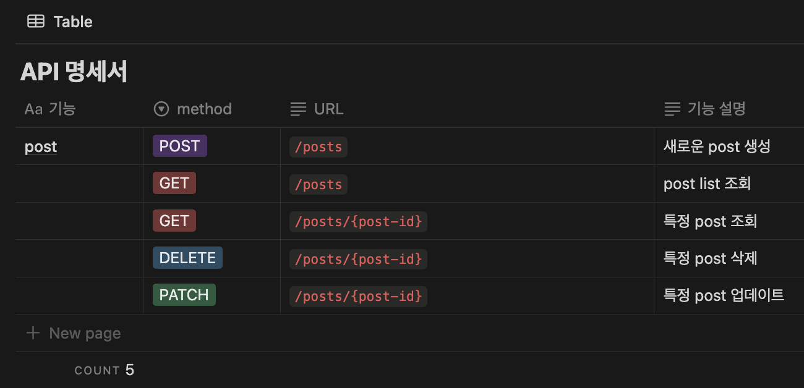

# spring-knowledgeIn-21st
ceos back-end 21st naver knowledge-in clone coding project

# Week2 

## 네이버 지식인 DB 모델링

### 요구 구현 기능

1. 게시글 조회
2. 게시글에 사진과 함께 글, 해시태그 작성하기
3. 게시글에 댓글 및 대댓글 기능
4. 게시글 댓글에 좋아요, 싫어요 기능
5. 게시글, 댓글, 좋아요 삭제 기능

### ERD Modeling


### 엔티티 관계

- User 1 — N Post
- User 1 — N Comment
- User 1 — N Reaction (리액션 삭제 기능이 있으려면 유저와 연결되어 있어야 할듯)
- Post 1 — N Image
- Post 1 — N PostHashtag
- Post 1 — N Comment
- Post 1 — N Reaction
- Hashtag 1 — N PostHashtag
- Comment 1 — N Reaction

### 엔티티 설명

- common > BaseEntity
    - createdAt, updatedAt 필드를 User, Post, Comment, Reaction에 적용

    ```jsx
    @MappedSuperclass
    @EntityListeners(AuditingEntityListener.class)
    @Getter
    public abstract class BaseEntity {
        @CreatedDate
        @Column(columnDefinition = "DATETIME")
        private LocalDateTime createdAt;
    
        @LastModifiedDate
        @Column(columnDefinition = "DATETIME")
        private LocalDateTime updatedAt;
    }
    ```

    - `@MappedSuperclass`
        - 객체의 입장에서 공통 매핑 정보가 필요할 때 사용
        - 공통 매핑 정보를 포함한 부모 클래스를 선언하고 속성만 상속 받아서 사용하고 싶을 때 사용함

          

        - Reference: [MappedSuperClass](https://ict-nroo.tistory.com/129)
    - `@EntityListeners(AuditingEntityListner.class)`
        - SpringBootApplication에 `@EnableJpaAuditing` 어노테이션을 붙여줘야 함
        - Auditing 기능을 사용할 수 있도록 함 → 엔티티가 생성되고, 변경되는 그 시점을 감지하여 생성시각, 수정시각, 생성한 사람, 수정한 사람을 기록할 수 있음
- User
    - 유저의 정보
    - 이후 로그인 기능 추가할때 password 및 보안 관련 필드 추가 예정
- Post
    - 게시물 정보
- Image
    - 게시물의 사진 URL 저장
- mapping > PostHashtag
    - 게시물과 해시태그의 매핑 엔티티
    - Post와 Hashtag가 N:M 관계인데 DB 모델링에서 지양해야하므로 사이에 mapping entity를 둬서 1:N, 1:M 관계로 매핑함
- Hashtag
    - 게시물에 붙일 해시태그 정보
    - 해시태그의 성격에 따라서 Enum, Varchar 타입으로 할지 정해야 할듯 (정형화된 태그면 Enum으로)
- Comment
    - 댓글 정보
    - 대댓글 기능
        - 부모 댓글에 자식 댓글들이 달리는 구조 → 1 : N

        ```jsx
        @ManyToOne(fetch = FetchType.LAZY)
        @JoinColumn(name = "parent_comment_id")
        private Comment parentComment; // Default로 nullable
        
        @OneToMany(mappedBy = "parentComment", cascade = CascadeType.ALL)
        private List<Comment> childrenCommentList = new ArrayList<>();
        ```

        - `parentComment`: 이 값이 `null`이면 부모 댓글임
        - `childrenCommentList`: 부모 댓글에 대한 대댓글들
        - Reference1: [대댓글 reference 1](https://velog.io/@ssm2053/Spring-%EB%8C%93%EA%B8%80%EC%9D%98-%EB%8B%B5%EA%B8%80-%EA%B8%B0%EB%8A%A5-%EA%B5%AC%ED%98%84-%EB%8C%80%EB%8C%93%EA%B8%80-%EA%B8%B0%EB%8A%A5-%EA%B5%AC%ED%98%84)
        - Reference2: [대댓글 reference 2](https://velog.io/@hhss2259/%EB%8C%80%EB%8C%93%EA%B8%80-%EB%8C%93%EA%B8%80%EC%9D%98-%EB%8C%93%EA%B8%80-%EA%B8%B0%EB%8A%A5-%EA%B5%AC%ED%98%84%ED%95%98%EA%B8%B0)
- Reaction
    - 댓글/게시물에 반응
    - enums > ContentType, enums > ReactionType

    ```jsx
    public enum ContentType {
        POST, COMMENT, NONE
    }
    
    public enum ReactionType {
        LIKE, UNLIKE, NONE
    }
    ```

    - `@DynamicInsert`, `@DynamicUpdate`
        - Hibernate(Spring JPA 구현체)는 엔티티를 데이터베이스에 등록하거나 데이터베이스에 있는 엔티티를 수정할 때 엔티티의 모든 필드를 업데이트 하는 방식으로 이루어짐
        - 굳이 모든 필드 수정이 필요없다면 실제 등록되거나 수정되는 칼럼에 대한 쿼리에 대해서만 insert 및 update를 해주도록 위의 어노테이션 사용
        - 칼럼에 디폴트 값을 설정하고 싶을 때 사용 가능

            ```jsx
            @Enumerated(EnumType.ORDINAL)
            @Column(columnDefinition = "VARCHAR(10) DEFAULT 'NONE'")
            private ContentType contentType;
            
            @Enumerated(EnumType.ORDINAL)
            @Column(columnDefinition = "VARCHAR(10) DEFAULT 'NONE'")
            private ReactionType reactionType;
            ```

        - Refrence: [DynamicInsert, DynamicUpdate](https://velog.io/@choidongkuen/JPA-%ED%94%84%EB%A1%9C%EA%B7%B8%EB%9E%98%EB%B0%8D-DynamicInsert-DynamicUpdate-%EC%97%90-%EB%8C%80%ED%95%B4-%EC%95%8C%EC%95%84%EB%B4%85%EC%8B%9C%EB%8B%A4)

### DB 생성 - 화긴


---

## Repository 단위 테스트

### Post Repository Test

```jsx
@SpringBootTest
public class PostRepositoryTest {
    @Autowired
    private PostRepository postRepository;
    @Autowired
    private UserRepository userRepository;

    @Test
    //@Transactional
    //@Rollback(false)
    void storePostTest() {
        // Post 저장 테스트

        // given - 유저 생성
        // ~~~(생략)
        
        // when - 포스트 생성
        // ~~~(생략)
        
        // then - 저장된 게시물 조회
        List<Post> postList = postRepository.findAll();

        Assertions.assertEquals(3, postList.size());

        postList.forEach(post -> {
            System.out.println("Post: " + post.getTitle());
            System.out.println("Writer: " + post.getUser().getNickname());
        });

    }
}

```


### `@SpringBootTest` vs `@DataJpaTest`

- `@SpringBootTest`
    - 스프링의 전체 애플리케이션 컨텍스트를 로드
    - `application.yml` 파일의 DB 설정으로 세팅해주며 mySQL도 지원 → so 이거 사용
    - 자동 rollback 지원 안하지만 `@SpringBootTest` + `@Transactional` 로 rollback 사용 가능
- `@DataJpaTest`
    - JPA 관련 컴포넌트(@Entity, Repository)만 로드하여 주로 DB 접근 레이어(Repository)만 테스트함
    - `application.yml` 파일의 DB 설정을 무시하고 h2 DB로 실행 → mySQL 지원 x ㅠㅠ
    - 자동으로 rollback 됨 (내부에 rollback 로직 포함) → rollback 안하려면 `@rollback(false)` 설정
  
---
## ReactionType에 None이 있는 이유

```jsx
public enum ReactionType {
    LIKE, UNLIKE, NONE
}
```

- `NONE` 옵션을 추가하여 soft delete 가능하도록 처리
- 좋아요/싫어요 클릭 특성상 여러번 연타하는 경우가 생길 수 있는데 그럴때마다 delete 쿼리를 날리는 것은 비효율적임
- Q. 하지만 db에 `NONE` 값을 가진 데이터가 쌓이는건 어떻게 해결할건지? 스케줄러 요청을 통해 `NONE`값을 오래동안 가지고 있는 데이터를 주기적으로 clean up

## 맵핑 엔티티에 기본키 vs 복합키

- 복합키를 사용하면 save를 여러번 해도 키의 중복을 막을 수 있으나 좀 더 복잡하고 만일 맵핑 엔티티에 속성이 추가된다면 불편해진다는 단점이 있음

### 기본키 방식: `@Table`의 `@UniqueConstraints` 조건

- 기존 엔티티 형식을 유지하면서 복합키의 장점인 중복키를 철저하게 배제하는 방법은?
- `@Table`의 `@UniqueConstraints` 조건 사용해서 복합적인 유니크 키를 정의한다!

    ```jsx
    @Table(
        name = "post_hashtag",
        uniqueConstraints = {
            @UniqueConstraint(columnNames = {"post_id", "hashtag_id"})
        }
    )
    public class PostHashtag {
    	...
    }
    ```

- Reference Doc: [복합키 맵핑](https://velog.io/@dev_hammy/Defining-Unique-Constraints-in-JPA)

### 복합키 방식: `@EmbeddedId`를 활용한 복합키 맵핑

- **@EmbeddedId** 를 적용한 식별자 클래스(ex.`PostHashtagId` 클래스) 조건
    - Serializable 인터페이스 구현
    - 기본 생성자 꼭 필요; `@NoArgsContructor(access = AccessLevel.PROTECTED)`
    - Public class여야함

        ```jsx
        @Getter
        @Embeddable
        @NoArgsContructor(access = AccessLevel.PROTECTED)
        @AllArgsContructor
        public class PostHashtagId implements serializable {
        		@Column(name = "post_id")
            private Long postId;
        
            @Column(name = "hashtag_id")
            private Long hashtagId;
        }
        ```

        ```jsx
        @Entity
        @Getter
        @NoArgsConstructor(access = AccessLevel.PROTECTED)
        @AllArgsConstructor
        public class PostHashtag {
        
            @EmbeddedId
            private PostHashtagId id;
            
            ...
        }
        ```


## 네이버 지식인 구조 확인

### Question & Answer 구조

- 지식인 구조를 확인해보니 Q&A 형식으로 Question, Answer 모두 Post 형식임을 확인
- Question에는 Comment가 아닌 Answer이 달리고 Answer에 Comment가 달리는 형식
- Question에는 Reaction 달릴 수 없음

### 수정 사항

- Post에 postType 필드 추가

    ```jsx
    public enum PostType {
        QUESTION, ANSWER;
    }
    ```

- Post 1 : N Post 관계 추가 → PostType이 Question인 경우만 Answer을 받을 수 있도록 구현해야함
- Commet 1 : N Comment 관계 삭제 → Comment는 Post 타입에 달리는 댓글
- Comment의 ContentType Enum 필드 삭제
- Comment 1 : N Reaction 관계 삭제 → 좋아요/싫어요는 Post의 Answer 타입에 달리는 반응


---
# Week3

## 지식인의 4가지 HTTP Method API 구현


### 새로운 Post 생성

- PostType에 따른 생성 과정 차이
    - `postType == PostType.QUESTION`
        - `questionId` 필드가 `null`이어야 함
        - Request & Response

            ```jsx
            {
              "questionId": null,
              "userId": 1,
              "postType": "QUESTION",
              "title": "잠깨고 싶어요",
              "content": "잠을 어떻게 깨나요.. 졸려요",
              "hashtagList": ["#잠", "#궁금", "#긴급"],
              "imageList": ["https://ceos-knowlege-in.s3.ap-northeast-2.amazonaws.com/question-image.png"]
            }
            
            {
              "isSuccess": true,
              "code": "COMMON200",
              "message": "성공입니다.",
              "result": {
                "postId": 1,
                "createdAt": "2025-03-30T00:27:54.818197"
              }
            }
            ```

    - `postType == PostType.ANSWER`
        - `questionId` 필드가 `null`이 아니어야 하고 해당 id의 부모 post가 존재해야 함
        - 부모글은 question type이어야 함
        - 해당 question post의 `AnswerPostList`에 추가되어야 함
        - Request & Response

            ```jsx
            {
              "questionId": 1,
              "userId": 2,
              "postType": "ANSWER",
              "title": "잠깨는 방법",
              "content": "잠을 효과적으로 깨기 위해서는 아아를 마셔야해요",
              "hashtagList": ["#잠", "#만능", "#아아"],
              "imageList": []
            }
            
            {
              "isSuccess": true,
              "code": "COMMON200",
              "message": "성공입니다.",
              "result": {
                "postId": 2,
                "createdAt": "2025-03-30T00:30:37.468488"
              }
            }
            ```


```java
if (request.getPostType() == PostType.QUESTION) {
    if (request.getQuestionId() != null) throw new GeneralException(ErrorStatus.QUESTION_SHOULD_NOT_EXIST);
} else {
    // request.getPostType() == PostType.ANSWER
    if (request.getQuestionId() == null) throw new GeneralException(ErrorStatus.QUESTION_SHOULD_EXIST);
    question = postRepository.findById(request.getQuestionId())
            .orElseThrow(() -> new GeneralException(ErrorStatus.PARENT_QUESTION_NOT_FOUND));
    if (question.getPostType() != PostType.QUESTION) throw new GeneralException(ErrorStatus.PARENT_IS_A_QUESTION);
}

// newPost 객체 생성 후

if (request.getPostType() == PostType.ANSWER) {
    question.addAnswerPost(newPost);
}
```

- 결과
    - Post: `QUESTION` 타입은 `questionId` 필드가 비어있고, 하나의 질문에 여러개의 답글이 달릴 수 있음을 확인

      
  
    - Hashtag: `tag` 필드에 `@Column(nuique = true)`를 해주니 겹치는 해시태그는 한번만 나옴PostHashTag 테이블 보면 맵핑은 잘 되어있는거 확인 가능)
      
     
    - Image: `image_url` 필드에 사진 url이 잘 올라가는 것을 확인할 수 있음 (사진 업로드는 aws s3 버킷 사용)
      
  
        - Reference Doc1: [aws s3 bucket](https://velog.io/@jinseoit/AWS-S3-bucket)
        - Refrence Doc2: [aws s3 bucket troubleshooting](https://velog.io/@ino5/S3-%EB%B2%84%ED%82%B7-%EC%A0%95%EC%B1%85-%EC%84%A4%EC%A0%95-%EC%8B%9C-Action-does-not-apply-to-any-resources-in-statement-%EC%97%90%EB%9F%AC)
        - Uploaded Pic: [uploaded pic](https://ceos-knowlege-in.s3.ap-northeast-2.amazonaws.com/question-image.png)

### Post List 조회

- 임의로 게시물 5개씩 페이지 구성하도록 구현(+질문만 모아서 볼 수 있도록 하는 기능을 추가해도 좋을 것 같다)
- Custom Annotation 생성: `@CheckPage`
    - 사용자 기준으로는 1이 첫 페이지지만 `Pageable` 객체는 0부터 시작하므로 이를 체크하고 조정해주는 validation을 주로 사용

    ```java
    @Documented
    @Constraint(validatedBy = PageCheckValidator.class)
    @Target({ElementType.METHOD, ElementType.FIELD, ElementType.PARAMETER})
    @Retention(RetentionPolicy.RUNTIME)
    public @interface CheckPage {
        String message() default "페이지 번호는 1 이상이어야 합니다.";
        Class<?>[] groups() default {};
        Class<? extends Payload>[] payload() default {};
    }
    
    public class PageCheckValidator implements ConstraintValidator<CheckPage, Integer> {
        @Override
        public boolean isValid(Integer page, ConstraintValidatorContext context) {
            if (page == null || page <= 0) {
                return false;
            }
    
            // 검증을 통과한 경우, 값 조정 (1 -> 0)
            if (page == 1) {
                context.disableDefaultConstraintViolation();
                context.buildConstraintViolationWithTemplate("페이지 번호를 0으로 변경했습니다.")
                        .addConstraintViolation();
            }
    
            return true;
        }
    }
    
    // 사용 at PostRestController
    public ApiResponse<PostResponseDTO.PreviewListDto> getPage(@CheckPage @RequestParam(name = "page") Integer page)
    ```

- 결과

    ```jsx
    {
      "isSuccess": true,
      "code": "COMMON200",
      "message": "성공입니다.",
      "result": {
        "previewList": [
          {
            "postId": 1,
            "userId": 1,
            "questionId": null,
            "postType": "QUESTION",
            "title": "잠깨고 싶어요",
            "createdAt": "2025-03-30T00:27:55"
          },
    			// 생략 ... 
          {
            "postId": 5,
            "userId": 2,
            "questionId": 4,
            "postType": "ANSWER",
            "title": "참나",
            "createdAt": "2025-03-30T00:54:57"
          }
        ],
        "listSize": 5,
        "totalPage": 2,
        "totalElements": 6,
        "isFirst": true,
        "isLast": false
      }
    }
    ```


### 특정 Post 조회

- Id 값으로 특정 post를 조회
- 리스트 조회와 마찬가지로 게시물의 preview를 조회
- 결과

    ```jsx
    {
      "isSuccess": true,
      "code": "COMMON200",
      "message": "성공입니다.",
      "result": {
        "postId": 4,
        "userId": 1,
        "questionId": null,
        "postType": "QUESTION",
        "title": "노래가 너무 좋아요",
        "createdAt": "2025-03-30T00:42:46"
      }
    }
    ```


### 특정 Post 삭제

- Soft Delete? Nope
    - Soft Delete를 고민했지만 기존 셜계대로 쿼리를 날려 Delete하는 방식을 택함
    - Soft Delete는 리액션 기능에 필요한 사항이고 게시물에 관해서는 굳이 필요하다고 느껴지지는 않았음
- AnswerPostList의 객체들 삭제 방법
    1. `orphanRemoval = true` 옵션 사용
        - 이 옵션을 사용하면 Question Post 객체를 삭제할때 answerPostList의 객체들도 같이 삭제 가능

        ```java
        @OneToMany(mappedBy = "questionPost", cascade = CascadeType.ALL, orphanRemoval = true)
        @Builder.Default
        private List<Post> answerPostList = new ArrayList<>();
        ```

    2. 순회하며 확실히 삭제 → 택
        - 하나하나 삭제하는 방법으로 1번보다는 덜 효율적이지만 delete되는 객체들에 대한 로깅을 하고 싶을때 (확실히 하고 싶을떄) 사용하기 좋을 듯

        ```java
        if (post.getPostType() == PostType.QUESTION) {
            for (Post answer: post.getAnswerPostList()) {
                postRepository.delete(answer);
            }
        }
        ```

    - 결과
        - 질문글인 4번을 삭제했더니 4번에 대한 대답글이었던 5번과 6번도 함께 삭제되는 것 확인

        ```jsx
        {
          "isSuccess": true,
          "code": "COMMON200",
          "message": "성공입니다.",
          "result": [
            {
              "postId": 5,
              "createdAt": "2025-03-30T00:54:57"
            },
            {
              "postId": 6,
              "createdAt": "2025-03-30T00:55:25"
            },
            {
              "postId": 4,
              "createdAt": "2025-03-30T00:42:46"
            }
          ]
        }
        
        ```