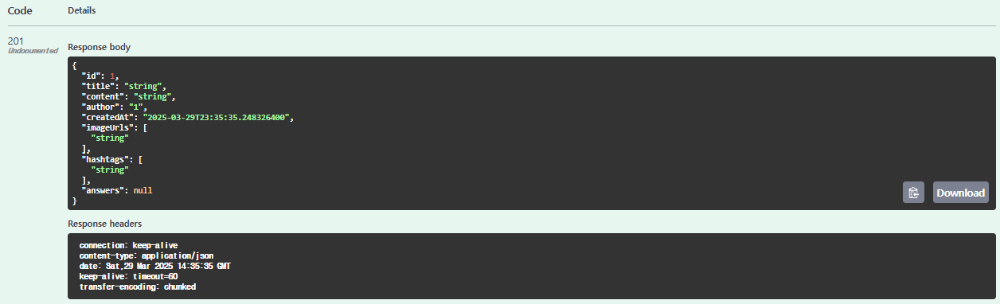

# spring-knowledgeIn-21st
ceos back-end 21st naver knowledge-in clone coding project

# week 2 - DB 모델링 및 JPA
___
### 네이버 지식인 서비스에 대한 이해

#### - 회원 :
네이버 지식인은 네이버를 통해 로그인을 하므로 네이버에서 필요로 하는 유저 정보를 찾아봤다.
네이버 회원가입할 때 필요한 정보는 이러하다


프로필 수정 페이지에서 수정 가능한 정보는 이러하다


따라서 필요한 정보는
- 아이디
- 비밀번호
- 이메일 주소(선택)
- 이름
- 생년월일
- 성별(선택)
- 전화번호

로 정리해봤다

#### - 게시글 :

- 제목
- 게시글 내용
- 작성 날짜
- 이미지

그리고 게시글에는 해시태그와 댓글을 추가할 수 있다.


#### - 해시태그

#### - 댓글 :

- 댓글 내용
- 작성 날짜
- 좋아요, 싫어요
- 작성자 정보
- 대댓글


___

### ERD


### 고민했던 부분
#### **'좋아요'**에 관해..
- '좋아요' 테이블 따로 설계?
  누가 좋아요를 눌렀는지에 대한 좋아요 목록보다는 숫자가 중요하다고 생각
  => 댓글의 일부로 만들고, 타입은 int로 해서 숫자 증가/감소하도록 만들기
- '좋아요' 구현 방법?
  둘 중에 고민
    - 좋아요,안좋아요 -> boolean으로 칼럼 1개 파기
    - 좋아요,싫어요 -> 칼럼 2개 파기
      => 근데 위에서 댓글의 일부로 만들고, 숫자로 저장하는 걸로 정해서 칼럼 2개 파는 걸로 결정

#### **'이미지'**에 관해..
- '게시글 이미지' 테이블을 따로 설계해야할지 고민
  => 매번 이미지 테이블까지 가서 조회하면 오래걸릴거 같아서 '게시글'의 일부로 포함시키기로 했다.

#### **'댓글'**에 관해..
- '대댓글' 구현 방법?
  사실 어떻게 해야할지 감이 잘 안와서...
  일단은 대댓글의 경우, 원댓글이 무엇인지 parent_comment에 저장하고, 그냥 일반 댓글(어떤 댓글에도 속해있지 않은 댓글)의 경우 parent_comment에는 Null을 저장하는 방식으로 하려고 한다.


최종적으로..
### 모델링에 대한 설명

#### 1. User (유저) 테이블 : 사용자 정보 저장
(user는 SQL에서 예약어이기 때문에, 이를 테이블 이름으로 사용할 수 없으므로 테이블 이름은 member로 설정함)

    user_id: 기본 키(Primary Key)로 각 유저를 식별하는 값
    ID: 사용자 아이디
    password: 비밀번호
    email: 이메일 (NULL 허용)
    name: 사용자 이름
    birthdate: 생년월일
    gender: 성별 (NULL 허용)
    phone_number: 전화번호
    profile_image_url: 프로필 이미지 URL

#### 2. Post (게시글) 테이블 : 사용자의 게시글 정보 저장

    post_id: 기본 키
    title: 게시글 제목
    post_content: 게시글 내용
    created_at: 작성 날짜 (기본값: 현재 시간)
    user_id: 작성한 유저의 ID (User 테이블의 user_id와 외래 키 관계)
    Field: 게시글 이미지 URL (NULL 허용)

#### 3. Comment (댓글) 테이블 : 게시글에 달린 댓글 저장

    comment_id: 기본 키
    comment_content: 댓글 내용
    created_at: 작성 날짜
    parent_comment: 원 댓글 ID (대댓글을 위한 컬럼, NULL 허용)
    like_count: 좋아요 수 (기본값 0)
    dislike_count: 싫어요 수 (기본값 0)
    post_id: 해당 댓글이 달린 게시글 ID (Post 테이블과 외래 키 관계)
    user_id: 댓글 작성자 ID (User 테이블과 외래 키 관계)

#### 4. Hashtag (해시태그) 테이블 : 게시글에 사용된 해시태그 정보 저장

    hashtag_id: 기본 키
    hashtag_name: 해시태그 이름

#### 5. Post-Hashtag (게시글-해시태그) 테이블 : 게시글과 해시태그 간 다대다(N:M) 관계를 관리

    post-hashtag_id: 기본 키
    post_id: 게시글 ID (Post 테이블과 외래 키 관계)
    hashtag_id: 해시태그 ID (Hashtag 테이블과 외래 키 관계)


#### 테이블 간 관계

    User - Post: 1:N (한 명의 유저가 여러 개의 게시글을 작성 가능)
    User - Comment: 1:N (한 명의 유저가 여러 개의 댓글을 작성 가능)
    Post - Comment: 1:N (한 개의 게시글에 여러 개의 댓글이 가능)
    Post - Hashtag: N:M (게시글 하나에 여러 개의 해시태그가 있을 수 있고, 하나의 해시태그가 여러 게시글에 사용될 수 있음)

# week 3 - CRUD API 만들기
___

기존 과제에서의 기능 요구 사항

```
구현 기능
1. 게시글 조회
2. 게시글에 사진과 함께 글, 해시태그 작성하기
3. 답변에 사진과 함께 글 작성하기  
4. 게시글에 답변 달 수 있고, 답변에 댓글 달 수 있는 기능 
5. 게시글 답변에 좋아요, 싫어요 기능 
6. 게시글, 답변, 댓글, 좋아요 삭제 기능
```

지식인 서비스를 조사하고 그에 맞게 엔티티를 구현하다보니까 기능 요구사항도 조금 달라져서 수정하고 구체화도 해봤다.
1. 게시글 조회
  - 게시글 조회 : 제목, 내용, 작성자, 작성 시간 등의 기본 정보 조회
  - 연관된 답변 목록 조회
  - 연관된 해시태그 조회 : 게시글과 관련된 해시태그 조회 -> 해당 해시태그로 관련 게시글을 찾을 수 있도록
  - 연관된 이미지 조회

2. 게시글 작성
  - 새로운 게시글 저장 : 제목, 내용, 이미지, 해시태그 포함
  - 이미지 
  - 해시태그 : 이미 존재하는 해시태그인지 확인 후, 없으면 새로 생성
  - 로그인된 사용자만 게시글 작성


- 세부사항
  - 성공적으로 게시글이 저장된 경우, 해당 게시글 정보 반환

3. 답변 작성
  - 특정 게시글에 대한 답변 작성 : 내용, 이미지 포함
  - 해당 게시글 ID와 연결
  - 로그인된 사용자만 답변 작성


- 세부사항
  - 성공적으로 답변이 저장된 경우, 해당 답변 정보 반환

4. 댓글 작성
  - 특정 답변에 대한 댓글 작성 : 내용만 포함
  - 해당 답변 ID와 연결
  - 로그인된 사용자만 댓글 작성


- 세부사항
  - 성공적으로 댓글이 저장된 경우, 해당 댓글 정보 반환

5. 좋아요/싫어요 누르는 기능
  - 특정 답변에 대해 좋아요/싫어요 추가 가능
  - 하나의 답변에 대해, 한 사용자가 한 반응만 추가 가능
  - 기존 반응 업데이트할 수 있는 기능   ???

6. 좋아요/싫어요 조회 기능
  - 각 답변에 대해 좋아요/싫어요 개수 조회

7. 게시글, 답변, 댓글, 좋아요 삭제 기능
  - 게시글 삭제 : 해당 게시글과 관련된 모든 답변, 댓글 삭제
  - 답변 삭제 : 해당 답변과 관련된 댓글, 반응 삭제
  - 댓글 삭제
  - 좋아요 삭제


- 세부사항
  - 삭제 전 : 해당 엔티티 존재하는지 확인
  - 삭제 후 : 삭제 성공 메시지 반환, 삭제된 항목은 더 이상 조회 못함

8. 해시태그
  - 게시글에 해시태그 추가/삭제


- 세부사항
  - 게시글에 해시태그 추가할 때 : 해시태그 이미 존재하는지 확인, 없으면 생성 가능
  - 게시글에 달린 해시태그 삭제할 때 : 해시태그가 다른 게시글과 연결되어 있지 않으면 해시태그도 삭제 ????????

**일단은 주 기능인 게시글 작성, 조회를 구현하기로 했다.**
```
4가지 HTTP Method API
1. 새로운 데이터를 create하도록 요청하는 API 만들기
2. 모든 데이터를 가져오는 API 만들기
3. 특정 데이터를 가져오는 API 만들기
4. 특정 데이터를 삭제 또는 업데이트하는 API
```

위 과제 틀대로
postService 안에 

- createPost - 게시글 생성 
- getPost - 특정 게시글 조회 
- getAllPosts - 전체 게시글 조회 
- updatePost - 게시글 수정 
- deletePost - 게시글 삭제
를 만들었다.


### Service 계층의 단위 테스트 


### Swagger 연동 후 Controller 테스트
게시글 생성

전체 게시글 조회


# week 4 - Spring Security와 로그인
___
## JWT를 이용한 인증 방식 - Access 토큰 & Refresh 토큰

### 토큰 발급 흐름
#### 1. 로그인 완료
- **SuccessHandler** : Access 토큰 & Refresh 토큰 발급

#### 2. 권한 필요한 모든 요청
- **JWTFilter** : Access 토큰 요청 검증

#### 3. 응답
- 데이터 응답
- **Access 토큰 만료 응답** & 프론트와 협의된 상태 코드

#### 4. Access 토큰 만료 응답을 받을 경우
- **Refresh 토큰**을 서버측으로 전송

#### 5. Access 토큰 재발급
- 기존 Access 토큰은 제거

## Refresh 토큰 보호방법
### <토큰의 저장 위치>
#### Access 토큰
- **로컬 스토리지**
  - CSRF 공격(짧은 시간)보단 XSS 공격받는게 나아서

#### Refresh 토큰
- **쿠키**
  - XSS 공격을 받을 수 있지만 httpOnly를 설정하면 완벽히 방어 가능해서
  - CSRF 공격 받아도, Refresh 토큰은 '토큰 재발급'만 하기 때문에 큰 피해 없음

### <Refresh 토큰 Rotate>
- Access 토큰 재발급할 때 **Refresh 토큰도 같이 재발급**해서 프론트에 응답

### <Refresh 토큰 블랙리스팅>
- Refresh 토큰을 발급할 때 **서버측 저장소에도 저장**
- **로그아웃** / **탈취**됐을 때 -> 서버측 저장소에서 해당 **토큰 삭제**
- 요청 올 때마다 **저장소에 존재하는지 확인**
  - 저장소에 없는데 요청 왔다면 해커가 토큰 복제해서 요청한 것

## 세션, 쿠키, OAuth 방식
### 세션 (Session)
- 정의: **서버**에서 사용자 정보를 유지하는 방식
- 위치: 서버 측 저장소
- 용도: 사용자 인증 정보 유지, 로그인 상태 관리 등
- 특징:
  - **클라이언트는 세션 ID만** 저장 (보통 쿠키를 통해 전달됨)
  - **서버는 해당 ID로 사용자 상태를 관리**
  - 보안이 비교적 높음, 단 서버 자원 사용

### 쿠키 (Cookie)
- 정의: **클라이언트**(브라우저)에 저장되는 작은 데이터 조각
- 위치: 클라이언트 측 저장소 (브라우저)
- 용도: 로그인 상태 유지, 사용자 설정 저장, 광고 추적 등
- 특징:
  - **서버가 쿠키를 생성**해서 **클라이언트에 저장**하도록 명령
  - 클라이언트는 이후 **요청마다 쿠키를 함께 전송**
  - 보안에 취약 (민감 정보 저장 지양)

### OAuth (Open Authorization)
- 정의: **타사 애플리케이션**이 **사용자 인증 없이** 제한된 리소스 접근을 허용하는 권한 위임 프로토콜
- 용도: 구글, 카카오, 페이스북 등 외부 로그인 연동
- 흐름:
  사용자 -> 제3자 서비스 로그인 요청
  제3자 서비스 -> 인증 서버에 인증 요청
  인증 서버 -> Access Token 발급
  제3자 서비스 -> Access Token으로 사용자 자원 접근
- 특징:
  - 비밀번호를 **외부 서비스에 제공하지 않음**
  - 보안성과 편의성 우수

## 회원가입 및 로그인 API 테스트

### 회원가입


### 로그인


## 토큰이 필요한 API 테스트

### 게시글 생성
#### w/o access 토큰

#### w/ 만료된 access 토큰

#### w/ 만료 안된 access 토큰


### 특정 게시글 조회


### 전체 게시글 조회
jeongha가 yunha가 쓴 글까지 볼 수 있음


### 자신이 쓴 전체 게시글 조회

jeongha는 jeongha가 쓴 글만 볼 수 있음

### 게시글 수정
#### w/ 다른 사람의 access 토큰
yunha는 jeongha의 글을 수정 못함

#### w/ 자신의 access 토큰


### 게시글 삭제
#### w/ 다른 사람의 access 토큰
yunha는 jeongha의 글을 삭제 못함

#### w/ 자신의 access 토큰


# week 5 - Docker
### **dockerfile** -> **image** -> **container**

#### 1. dockerfile 작성
- OS
  ex) Ubuntu
- 프로그램, 라이브러리
  ex) Python, Node.js
- SDK
  ex) JDK21
- 코드
  ex) print("hello") / app.jar

#### 2. image 빌드 : docker build(dockerfile 기반으로 image 생성)
```
./gradlew build 
docker build -t knowledgein . 
```

#### 3. container 실행 : docker run
```
docker run -p 8080:8080 knowledgein
```
http://localhost:8080 에 접속해 서버가 잘 띄워져 있는 것 확인!
